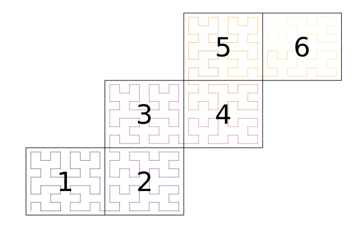

# API

```@meta
CurrentModule = ClimaCore
```

## Utilities

```@docs
Utilities.PlusHalf
Utilities.half
Utilities.UnrolledFunctions
```

### Utilities.Cache

```@docs
Utilities.Cache
Utilities.Cache.cached_objects
Utilities.Cache.clean_cache!
```

## DataLayouts

```@docs
DataLayouts
DataLayouts.DataF
DataLayouts.IF
DataLayouts.IJF
DataLayouts.VF
DataLayouts.IFH
DataLayouts.IJFH
DataLayouts.VIFH
DataLayouts.VIJFH
DataLayouts.IHF
DataLayouts.IJHF
DataLayouts.VIHF
DataLayouts.VIJHF
```

## Geometry

### Global Geometry
```@docs
Geometry.AbstractGlobalGeometry
Geometry.CartesianGlobalGeometry
```

### Coordinates
```@docs
Geometry.AbstractPoint
Geometry.float_type
```

Points represent _locations_ in space, specified by coordinates in a given
coordinate system (Cartesian, spherical, etc), whereas vectors, on the other hand,
represent _displacements_ in space.

An analogy with time works well: times (also called instants or datetimes) are
_locations_ in time, while, durations are _displacements_ in time.

**Note 1**: Latitude and longitude are specified via angles (and, therefore, trigonometric functions:
`cosd`, `sind`, `acosd`, `asind`, `tand`,...) in degrees, not in radians.
Moreover, `lat` (usually denoted by ``\theta``) ``\in [-90.0, 90.0]``, and `long`
(usually denoted by ``\lambda``) ``\in [-180.0, 180.0]``.

**Note 2:**: In a `Geometry.LatLongZPoint(lat, long, z)`, `z` represents the
elevation above the surface of the sphere with radius R (implicitly accounted for in the geoemtry).

**Note 3**: There are also a set of specific Cartesian points
(`Cartesian1Point(x1)`, `Cartesian2Point(x2)`, etc). These are occasionally
useful for converting everything to a full Cartesian domain (e.g. for visualization
purposes). These are distinct from `XYZPoint` as `ZPoint` can mean different
things in different domains.

## Domains

### Types
```@docs
Domains.AbstractDomain
Domains.IntervalDomain
Domains.RectangleDomain
Domains.SphereDomain
```

### Interfaces
```@docs
Domains.boundary_names
```

## Meshes
A `Mesh` is a division of a domain into elements.

### Mesh types
```@docs
Meshes.AbstractMesh
Meshes.IntervalMesh
Meshes.RectilinearMesh
Meshes.AbstractCubedSphere
Meshes.EquiangularCubedSphere
Meshes.EquidistantCubedSphere
Meshes.ConformalCubedSphere
```

### Local element map

```@docs
Meshes.LocalElementMap
Meshes.IntrinsicMap
Meshes.NormalizedBilinearMap
```

### Mesh stretching
```@docs
Meshes.Uniform
Meshes.ExponentialStretching
Meshes.GeneralizedExponentialStretching
Meshes.HyperbolicTangentStretching
```

### Mesh utilities
```@docs
Meshes.truncate_mesh
```

### Interfaces
```@docs
Meshes.domain
Meshes.elements
Meshes.nelements
Meshes.is_boundary_face
Meshes.boundary_face_name
Meshes.opposing_face
Meshes.coordinates
Meshes.containing_element
Meshes.reference_coordinates
Meshes.SharedVertices
Meshes.face_connectivity_matrix
Meshes.vertex_connectivity_matrix
Meshes.linearindices
Meshes.element_horizontal_length_scale
```

## Topologies
A `Topology` determines the ordering and connections between elements of a mesh.

### Types
```@docs
Topologies.AbstractTopology
Topologies.IntervalTopology
Topologies.Topology2D
Topologies.spacefillingcurve
Topologies.nelems
Topologies.nneighbors
Topologies.nsendelems
Topologies.nghostelems
Topologies.localelemindex
Topologies.face_node_index
Topologies.ghost_faces
Topologies.vertex_node_index
Topologies.local_vertices
Topologies.ghost_vertices
Topologies.neighbors
```

### Interfaces
```@docs
Topologies.mesh
Topologies.nlocalelems
Topologies.vertex_coordinates
Topologies.opposing_face
Topologies.interior_faces
Topologies.boundary_tags
Topologies.boundary_tag
Topologies.boundary_faces
Topologies.local_neighboring_elements
Topologies.ghost_neighboring_elements
```

## Grids

```@docs
Grids.CellFace
Grids.CellCenter
Grids.ColumnGrid
Grids.FiniteDifferenceGrid
Grids.ExtrudedFiniteDifferenceGrid
Grids.SpectralElementGrid1D
Grids.SpectralElementGrid2D
```

## Hypsography

```@docs
Grids.Flat
```

## CommonGrids

```@docs
CommonGrids
CommonGrids.ExtrudedCubedSphereGrid
CommonGrids.CubedSphereGrid
CommonGrids.ColumnGrid
CommonGrids.Box3DGrid
CommonGrids.SliceXZGrid
CommonGrids.RectangleXYGrid
```

## Spaces
A `Space` represents a discretized function space over some domain.
Currently two main discretizations are supported: Spectral Element Discretization
(both Continuous Galerkin and Discontinuous Galerkin types) and a staggered
Finite Difference Discretization. Combination of these two in the horizontal/vertical
directions, respectively, is what we call a _hybrid_ space.

Sketch of a 2DX hybrid discretization:


```@docs
Spaces
Spaces.Δz_data
```
### Finite Difference Spaces
ClimaCore.jl supports staggered Finite Difference discretizations. Finite Differences
discretize an interval domain by approximating the function by a value at either
the center of each element (also referred to as _cell_) (`CenterFiniteDifferenceSpace`),
or the interfaces (faces in 3D, edges in 2D or points in 1D) between elements
(`FaceFiniteDifferenceSpace`).

```@docs
Spaces.FiniteDifferenceSpace
```

Users should construct either the center or face space from the mesh, then construct
the other space from the original one: this internally reuses the same data structures, and avoids allocating additional memory.

#### Internals
```@docs
Spaces.Δz_metric_component
```

### Spectral Element Spaces

```@docs
Spaces.SpectralElementSpace1D
Spaces.SpectralElementSpace2D
Spaces.SpectralElementSpaceSlab
```

```@docs
Spaces.node_horizontal_length_scale
```

### Extruded Finite Difference Spaces

```@docs
Spaces.ExtrudedFiniteDifferenceSpace
```

## CommonSpaces

```@docs
CommonSpaces
CommonSpaces.ExtrudedCubedSphereSpace
CommonSpaces.CubedSphereSpace
CommonSpaces.ColumnSpace
CommonSpaces.Box3DSpace
CommonSpaces.SliceXZSpace
CommonSpaces.RectangleXYSpace
```

### Quadratures


```@docs
Quadratures.QuadratureStyle
Quadratures.GLL
Quadratures.GL
Quadratures.Uniform
Quadratures.degrees_of_freedom
Quadratures.polynomial_degree
Quadratures.quadrature_points
Quadratures.barycentric_weights
Quadratures.interpolation_matrix
Quadratures.differentiation_matrix
Quadratures.orthonormal_poly
```

#### Internals

```@docs
Topologies.dss_transform
Topologies.dss_transform!
Topologies.dss_untransform!
Topologies.dss_untransform
Topologies.dss_local_vertices!
Topologies.dss_local!
Topologies.dss_local_ghost!
Topologies.dss_ghost!
Topologies.create_dss_buffer
Topologies.fill_send_buffer!
Topologies.DSSBuffer
Topologies.load_from_recv_buffer!
Topologies.dss!
Spaces.weighted_dss_start!
Spaces.weighted_dss_internal!
Spaces.weighted_dss_ghost!
Spaces.weighted_dss!
Spaces.unique_nodes
```

#### Utilities

```@docs
Spaces.area
Spaces.local_area
```

## RecursiveApply

```@docs
RecursiveApply
```

## Fields

```@docs
Fields.Field
Fields.coordinate_field
Fields.local_geometry_field
Base.zeros(::Spaces.AbstractSpace)
Base.ones(::Spaces.AbstractSpace)
Base.sum(::Fields.Field)
Fields.local_sum
Fields.Statistics.mean(::Fields.Field)
Fields.LinearAlgebra.norm(::Fields.Field)
Fields.set!
Fields.ColumnIndex
Fields.bycolumn
Fields.Δz_field
```

## Hypsography

```@docs
Hypsography.LinearAdaption
Hypsography.SLEVEAdaption
Hypsography.diffuse_surface_elevation!
Hypsography.ref_z_to_physical_z
```

## Limiters

The limiters supertype is
```@docs
Limiters.AbstractLimiter
```

This class of flux-limiters is applied only in the horizontal direction (on spectral advection operators).


### Interfaces
```@docs
Limiters.QuasiMonotoneLimiter
Limiters.compute_bounds!
Limiters.apply_limiter!
```

### Internals
```@docs
Limiters.compute_element_bounds!
Limiters.compute_neighbor_bounds_local!
Limiters.compute_neighbor_bounds_ghost!
Limiters.apply_limit_slab!
```

## InputOutput

### Writers
```@docs
InputOutput.HDF5Writer
InputOutput.write!
```

### Readers
```@docs
InputOutput.HDF5Reader
InputOutput.read_domain
InputOutput.read_mesh
InputOutput.read_topology
InputOutput.read_space
InputOutput.read_field
InputOutput.defaultname
```

## Remapping

```@docs
Remapping.interpolate_array
Remapping.interpolate
```
