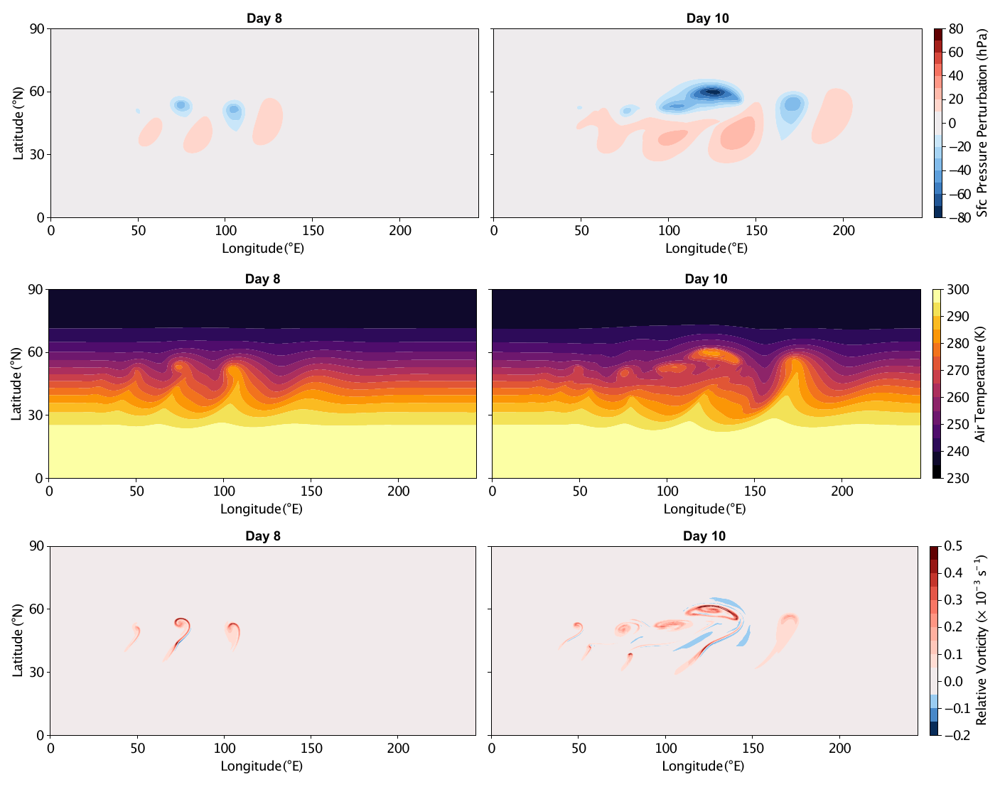
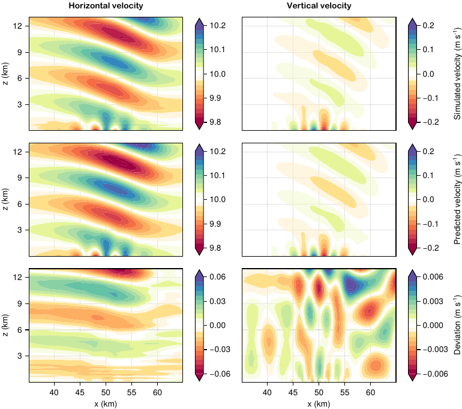

# Example gallery

The [`examples/`](https://github.com/CliMA/ClimaCore.jl/tree/main/examples)
directory holds runnable cases that exercise the library; [Run the
examples](../howto/run_examples.md) says how to run them. This page states the
equations of the documented cases in the notation of the explanation pages and
shows how each script discretizes them, quoting the script's own tendency
function. Most code blocks are copied from the scripts, which CI runs, and are
not re-executed by the documentation build; the two column cases below run a
compact version here to draw a figure. Figures from [Yatunin2026](@cite)
illustrate the costlier cases. The last section lists the remaining cases with
the feature each
demonstrates.

Notation: `ρ` density, `q` tracer concentration per unit mass, `u` velocity
with covariant components `u_i` (`Covariant12Vector` in the horizontal,
`Covariant3Vector` in the vertical) and contravariant components `uⁱ`;
`∇ₕ ⋅`, `∇ₕ` the horizontal spectral-element divergence and gradient, of which
`Divergence{WeakForm}` is the weak form ([Spectral elements: CG and
DG](discretizations.md)); `∂ᵥ` the vertical finite-difference derivative
between cell faces and centers ([Staggered vertical
discretization](vertical.md)). Weak-form horizontal tendencies are completed
by DSS ([DSS and numerical fluxes](interelement.md)).

## Heat equation on a column

[`examples/column/heat.jl`](https://github.com/CliMA/ClimaCore.jl/blob/main/examples/column/heat.jl)
solves

```math
\frac{\partial T}{\partial t} = \alpha\, \nabla^2 T
```

on `z ∈ [0, 1]` with 10 cells, `T = 0` at the bottom and `∂T/∂z = 1` at the
top, starting from `T = 0`. The temperature lives on cell centers. The Laplacian
is a center-to-face gradient followed by a face-to-center divergence, and both
boundary conditions enter through the gradient at the boundary faces: the
Dirichlet value through `gradient_c2f_dirichlet`, which builds the
`SetGradient` stencil a prescribed boundary value implies, and the Neumann
value as an explicit `SetGradient`.

```@example gallery
import ClimaComms
ClimaComms.@import_required_backends
import ClimaCore: Fields, Domains, Meshes, Operators, Geometry, Spaces
import ClimaTimeSteppers as CTS
using CairoMakie

FT = Float64
domain = Domains.IntervalDomain(
    Geometry.ZPoint{FT}(0),
    Geometry.ZPoint{FT}(1);
    boundary_names = (:bottom, :top),
)
mesh = Meshes.IntervalMesh(domain; nelems = 10)
cspace = Spaces.CenterFiniteDifferenceSpace(ClimaComms.device(), mesh)
T = Fields.zeros(FT, cspace)

α, T_bottom, dTdz_top = FT(0.1), FT(0), FT(1)
function tendency!(dT, T, _, t)
    ∇T = Operators.gradient_c2f_dirichlet(
        T;
        bottom = T_bottom,
        top = Operators.SetGradient(Geometry.WVector(dTdz_top)),
    )
    divf2c = Operators.DivergenceF2C()
    return @. dT = α * divf2c(∇T)
end

prob = CTS.ODEProblem(CTS.ClimaODEFunction(; T_exp! = tendency!), T, (0.0, 10.0), nothing)
sol = CTS.solve(
    prob,
    CTS.ExplicitAlgorithm(CTS.SSP33ShuOsher());
    dt = 0.02,
    saveat = [0.0, 0.5, 1.0, 2.0, 5.0, 10.0],
)

z = vec(parent(Fields.coordinate_field(cspace).z))
fig = Figure(; size = (600, 450))
ax = Axis(fig[1, 1]; xlabel = "T", ylabel = "z")
for (t, u) in zip(sol.t, sol.u)
    lines!(ax, vec(parent(u)), z; label = "t = $(round(t; digits = 1))")
end
lines!(ax, z, z; color = :black, linestyle = :dash, label = "steady state")
axislegend(ax; position = :rb)
fig
```

The column heats from `T ≡ 0` toward the steady state `T = z`. The run checks
the profile against the separable exact solution at every saved time. [Solve a
column PDE](../tutorials/column_heat.md) walks through the same
problem.

## Advection on a column

[`examples/column/advect.jl`](https://github.com/CliMA/ClimaCore.jl/blob/main/examples/column/advect.jl)
solves

```math
\frac{\partial \theta}{\partial t} = -\frac{\partial (w\, \theta)}{\partial z}
```

on `z ∈ [0, 4π]` with 128 cells, a constant upward velocity `w` on faces, and
`θ(z, 0) = sin z`, so the exact solution is the translated sine wave and also
supplies the boundary values. The script compares four discretizations of the
same equation:

  - **Flux form, upwind**: the face flux `w θ` is reconstructed by first-order
    upwinding and differenced back to centers. `UpwindBiasedProductC2F` has no
    boundary-value condition of its own, so
    `upwind_biased_product_c2f_dirichlet` evaluates the upwind stencil at the
    two boundary faces with the exact `θ` outside the domain.

    ```julia
    upwind_flux(θ, t) = Operators.upwind_biased_product_c2f_dirichlet(
        w, θ; left = exact_θ(z_left, t), right = exact_θ(z_right, t),
    )
    function tendency_upwind!(dθ, θ, _, t)
        flux = upwind_flux(θ, t)
        divf2c = Operators.DivergenceF2C()
        return @. dθ = -divf2c(flux)
    end
    ```

  - **Advective form, centered**: `w ∂θ/∂z` from a center-to-face gradient,
    contracted with the contravariant velocity and interpolated back to
    centers. At the inflow face, the gradient is the one implied by the exact
    value outside the domain; at the outflow face, it is extrapolated from the
    last two centers.

    ```julia
    function tendency_centered!(dθ, θ, _, t)
        ∇θ = centered_advection_gradient(θ, t)
        interpf2c = Operators.InterpolateF2C()
        return @. dθ = -interpf2c(Geometry.dot(Geometry.Contravariant3Vector(w), ∇θ))
    end
    ```

  - **Either form plus a flux correction**: a diffusive flux with diffusivity
    `|w| Δz`, built from a center-to-face gradient (zero on both boundary faces,
    so no correction flux crosses them) and a face-to-center gradient. First-order
    upwinding introduces numerical diffusion of half this size, so adding the
    term to the upwind form doubles it and adding it to the centered form
    supplies the diffusion that form lacks.

    ```julia
    function tendency_upwind_corrected!(dθ, θ, _, t)
        flux = upwind_flux(θ, t)
        divf2c = Operators.DivergenceF2C()
        correction = flux_correction(θ)
        return @. dθ = -divf2c(flux) + correction
    end
    ```

The first-order upwind flux form, integrated over one period, shows the
numerical diffusion the bullets describe: the wave returns to `sin z` but with a
damped amplitude.

```@example gallery
domain = Domains.IntervalDomain(
    Geometry.ZPoint{FT}(0),
    Geometry.ZPoint{FT}(4π);
    boundary_names = (:left, :right),
)
mesh = Meshes.IntervalMesh(domain; nelems = 128)
cspace = Spaces.CenterFiniteDifferenceSpace(ClimaComms.device(), mesh)
fspace = Spaces.FaceFiniteDifferenceSpace(cspace)
w = Geometry.WVector.(ones(FT, fspace))
exact_θ(z, t) = sin(z - t)
z_left, z_right = FT(0), FT(4π)

function tendency_upwind!(dθ, θ, _, t)
    flux = Operators.upwind_biased_product_c2f_dirichlet(
        w, θ; left = exact_θ(z_left, t), right = exact_θ(z_right, t),
    )
    divf2c = Operators.DivergenceF2C()
    return @. dθ = -divf2c(flux)
end

θ₀ = exact_θ.(Fields.coordinate_field(cspace).z, 0)
prob = CTS.ODEProblem(
    CTS.ClimaODEFunction(; T_exp! = tendency_upwind!),
    θ₀,
    (0.0, 2π),
    nothing,
)
sol = CTS.solve(
    prob,
    CTS.ExplicitAlgorithm(CTS.SSP33ShuOsher());
    dt = 2π / 400,
    saveat = [0.0, 2π],
)

z = vec(parent(Fields.coordinate_field(cspace).z))
fig = Figure(; size = (700, 380))
ax = Axis(fig[1, 1]; xlabel = "z", ylabel = "θ")
lines!(ax, z, vec(parent(sol.u[end])); label = "first-order upwind, t = 2π")
lines!(ax, z, exact_θ.(z, 2π); color = :black, linestyle = :dash, label = "exact")
axislegend(ax; position = :rt)
fig
```

## Tracer transport with limiters

Three scripts solve the same transport problem on different geometries: mass
and a tracer density carried by a prescribed, time-reversing flow, so that the
tracer must return to its initial shape, with the horizontal transport limited
by `Limiters.QuasiMonotoneLimiter` [GubaOpt2014](@cite):

```math
\frac{\partial \rho}{\partial t} + \nabla \cdot (\rho u) = 0, \qquad
\frac{\partial \rho q}{\partial t} + \nabla \cdot (\rho q\, u) = -\nu_4\, \nabla_h \cdot \bigl(\rho\, \nabla_h \nabla_h^2 q\bigr).
```

The right-hand side is fourth-order horizontal hyperdiffusion of the
concentration, written as two Laplacian passes with a DSS of the intermediate
field between them (see the [CG and DG page](discretizations.md)); `ν₄` is
zero by default on the plane. The initial conditions are cosine bells, Gaussian
bells, or slotted cylinders (`cylinders`, `slotted_spheres`).

**Plane**
([`examples/plane/limiters_advection.jl`](https://github.com/CliMA/ClimaCore.jl/blob/main/examples/plane/limiters_advection.jl)):
a doubly periodic square `[−2π, 2π]²` with the rotation
`u = −u₀ (y − c_y) cos(πt/T)`, `v = u₀ (x − c_x) cos(πt/T)`, reversed at
`t = T/2`. The whole tendency is the weak divergence of the fluxes:

```julia
function tendency!(yₜ, y, parameters, t)
    (; u, Δₕq) = parameters
    grad = Operators.Gradient()
    wdiv = Operators.Divergence{Operators.WeakForm}()
    coord = Fields.coordinate_field(axes(u))
    @. u = Geometry.UVVector(
        -u0 * (coord.y - flow_center.y) * cospi(t / end_time),
        u0 * (coord.x - flow_center.x) * cospi(t / end_time),
    )
    @. Δₕq = wdiv(grad(y.ρq / y.ρ))
    Spaces.weighted_dss!(Δₕq)
    @. yₜ.ρ = -wdiv(y.ρ * u)
    @. yₜ.ρq = -wdiv(y.ρq * u) - D₄ * wdiv(y.ρ * grad(Δₕq))
end
```

The limiter and the DSS are callbacks of the time stepper, run after each
stage: the bounds come from the stage's starting state `y_ref`, and the
limited tracer is then made continuous.

```julia
function lim!(y, parameters, t, y_ref)
    Limiters.compute_bounds!(parameters.limiter, y_ref.ρq, y_ref.ρ)
    Limiters.apply_limiter!(y.ρq, y.ρ, parameters.limiter)
end
dss!(y, parameters, t) = Spaces.weighted_dss!(y)
```

**Sphere**
([`examples/sphere/limiters_advection.jl`](https://github.com/CliMA/ClimaCore.jl/blob/main/examples/sphere/limiters_advection.jl)):
the same tendency on a cubed sphere with the deformational flow of the
standard test [GubaOpt2014](@cite), `u = k sin²λ sin 2φ cos(πt/T) + (2πR/T) cos φ`,
`v = k sin 2λ cos φ cos(πt/T)`, over `T = 12` days. The velocity is set in the
orthonormal (`UVVector`) basis and the operators convert it; nothing in the
tendency refers to the geometry.

**Box**
([`examples/hybrid/box/limiters_advection.jl`](https://github.com/CliMA/ClimaCore.jl/blob/main/examples/hybrid/box/limiters_advection.jl)):
an extruded domain `[−2π, 2π]² × [0, 4π]` with the rotation above plus a
vertical velocity `w = u₀ sin(πz/z_top) cos(πt/T)`. The horizontal tendency is
the plane's; the vertical tendency reconstructs face fluxes from center values
and differences them back with zero flux through the top and bottom. Density
is interpolated to faces; the tracer is carried by third-order upwinding on the
vertical velocity component and by interpolation on the horizontal one.

```julia
function vertical_tendency!(yₜ, y, cache, t)
    (; face_u, params) = cache
    Ic2f = Operators.InterpolateC2F()
    vdivf2c = Operators.DivergenceF2C(
        top = Operators.SetValue(Geometry.Contravariant3Vector(FT(0))),
        bottom = Operators.SetValue(Geometry.Contravariant3Vector(FT(0))),
    )
    upwind3 = Operators.Upwind3rdOrderBiasedProductC2F(
        bottom = Operators.Extrapolate(1),
        top = Operators.Extrapolate(1),
    )
    ax12 = (Geometry.Covariant12Axis(),)
    ax3 = (Geometry.Covariant3Axis(),)
    @. face_u = local_velocity(params, Fields.coordinate_field(face_u), t)
    @. yₜ.ρ = -vdivf2c(Ic2f(y.ρ) * face_u)
    @. yₜ.ρq =
        -vdivf2c(Ic2f(y.ρq) * Geometry.project(ax12, face_u)) -
        vdivf2c(Ic2f(y.ρ) * upwind3(Geometry.project(ax3, face_u), y.ρq / y.ρ))
end
```

The limiter acts on the horizontal spectral-element structure, so its place in
the sequence matters: horizontal transport, limiter, vertical transport, DSS.

## Shallow water on the sphere

[`examples/sphere/shallow_water.jl`](https://github.com/CliMA/ClimaCore.jl/blob/main/examples/sphere/shallow_water.jl)
solves the shallow-water equations in vector-invariant form [Bao2014](@cite) on
the cubed sphere,

```math
\frac{\partial h}{\partial t} + \nabla \cdot (h u) = -\nu_4 \nabla^4 h, \qquad
\frac{\partial u_i}{\partial t} + \bigl((f + \nabla \times u) \times u\bigr)_i
  = -\nabla_i \left(g (h + h_s) + \tfrac12 \|u\|^2\right) - \nu_4 (\nabla^4 u)_i,
```

with `h` the fluid depth, `h_s` the surface height, `f` the Coriolis parameter,
and biharmonic hyperdiffusion on both variables. The velocity is a
`Covariant12Vector`; its curl is a `Contravariant3Vector` (the vertical
vorticity), and the cross product with `u` returns covariant components. The
scalar hyperdiffusion is two weak-divergence-of-gradient passes; the vector
hyperdiffusion is two passes of the grad-div minus curl-curl vector Laplacian.
Both intermediates are made continuous by one DSS before the second pass, and
the completed tendency by a final DSS.

```julia
function rhs!(dYdt, y, parameters, t)
    (; f, h_s, ghost_buffer, params) = parameters
    D₄ = params.ν₄ * Spaces.node_horizontal_length_scale(axes(y))^3
    div = Operators.Divergence()
    wdiv = Operators.Divergence{Operators.WeakForm}()
    grad = Operators.Gradient()
    wgrad = Operators.Gradient{Operators.WeakForm}()
    curl = Operators.Curl()
    wcurl = Operators.Curl{Operators.WeakForm}()

    # first Laplacian pass of the hyperdiffusion
    @. dYdt.h = wdiv(grad(y.h))
    @. dYdt.u =
        wgrad(div(y.u)) -
        Geometry.Covariant12Vector(wcurl(Geometry.Covariant3Vector(curl(y.u))))
    Spaces.weighted_dss!(dYdt, ghost_buffer)

    # second pass, then the dynamics
    @. dYdt.h = -D₄ * wdiv(grad(dYdt.h))
    @. dYdt.u =
        -D₄ * (
            wgrad(div(dYdt.u)) -
            Geometry.Covariant12Vector(wcurl(Geometry.Covariant3Vector(curl(dYdt.u))))
        )
    @. begin
        dYdt.h += -wdiv(y.h * y.u)
        dYdt.u += -grad(params.g * (y.h + h_s) + norm(y.u)^2 / 2) + y.u × (f + curl(y.u))
    end
    Spaces.weighted_dss!(dYdt, ghost_buffer)
    return dYdt
end
```

The hyperdiffusion coefficient scales with the cube of the node spacing, so
`ν₄` is a resolution-independent input. Five test cases are selected by the
first command-line argument: `steady_state` and `steady_state_compact` (cases 2
and 3 of [Williamson1992](@cite), zonal geostrophic flows whose exact solution
is the initial state, with an optional rotation angle `α` of the flow axis
against the cubed-sphere axis), `mountain` (case 5, flow over an isolated
mountain through `h_s`), `rossby_haurwitz` (case 6), and
`barotropic_instability` (the unstable zonal jet of [Galewsky2004](@cite)).
[Shallow water on a plane](../tutorials/shallow_water_plane.md) is the same
formulation on a Cartesian plane.

## Deformation flow on the extruded sphere

[`examples/hybrid/sphere/deformation_flow.jl`](https://github.com/CliMA/ClimaCore.jl/blob/main/examples/hybrid/sphere/deformation_flow.jl)
is the three-dimensional transport test 1.1 of [Ullrich2012DynamicalCM](@cite):
five tracers carried by a prescribed, reversing deformational flow on a shell
from the surface to 12 km, with the horizontal limiter of the previous section
and a choice of vertical flux-corrected transport. The horizontal tendency uses
the strong divergence for transport and the weak form for the hyperdiffusion:

```julia
function horizontal_tendency!(Yₜ, Y, cache, t)
    (; u, Δₕq) = cache
    @. u = local_velocity(Fields.coordinate_field(Y.c), t)
    @. Δₕq = hwdiv(hgrad(Y.c.ρq / Y.c.ρ))
    Spaces.weighted_dss!(Δₕq)
    @. Yₜ.c.ρ = -hdiv(Y.c.ρ * u)
    @. Yₜ.c.ρq = -hdiv(Y.c.ρq * u) - D₄ * hwdiv(Y.c.ρ * hgrad(Δₕq))
end
```

The vertical tendency interpolates the density to faces with the
Jacobian-weighted interpolation (`WeightedInterpolateC2F`, so that the face
density is consistent with the cell masses) and reconstructs the tracer face
flux with the operator selected at run time: plain interpolation, first- or
third-order upwinding, Zalesak flux-corrected transport (the default), a TVD
slope-limited flux, or the van Leer limiter. The FCT operators take the
antidiffusive flux (third-order minus first-order) and the bounds it must
respect:

```julia
@. face_ρ = winterp(J, Y.c.ρ)
@. Yₜ.c.ρ = -vdiv(face_ρ * face_u)
# with fct_op == FCTZalesak:
@. Yₜ.c.ρq =
    -vdiv(
        face_ρ * upwind1(face_u, q) +
        FCTZalesak(
            face_ρ * (upwind3(face_u, q) - upwind1(face_u, q)),
            tuple(q / dt, q / dt - vdiv(face_ρ * upwind1(face_u, q)) / Y.c.ρ),
        ),
    )
```

where `vdiv` is a `DivergenceF2C` with zero flux at the top and bottom and the
`upwind` operators extrapolate at the boundaries. The run reports the
conservation errors of mass and of each tracer, and the limiter and FCT
combinations are compared against the analytic return to the initial state.
[Limit tracers](../howto/limiters.md) collects the limiter calls.

## Baroclinic wave on the extruded sphere



*Dry baroclinic wave on the sphere: surface pressure perturbation (top), air
temperature (middle), and relative vorticity (bottom) at day 8 (left) and day 10
(right), as the balanced jet breaks into cyclones. From [Yatunin2026](@cite).*

[`examples/hybrid/sphere/baroclinic_wave_rhoe.jl`](https://github.com/CliMA/ClimaCore.jl/blob/main/examples/hybrid/sphere/baroclinic_wave_rhoe.jl)
integrates the dry compressible Euler equations on a cubed-sphere shell, with
continuous (CG) horizontal spectral elements and vertical finite differences.
It is the standard dry-dynamical-core benchmark of [Ullrich14b](@cite): a
balanced zonal jet, perturbed by a localized bump, grows over ten days into a
breaking wave. Total energy `ρe` is the prognostic thermodynamic variable, so
the equations are

```math
\frac{\partial \rho}{\partial t} = -\nabla \cdot (\rho u), \qquad
\frac{\partial \rho e}{\partial t} = -\nabla \cdot \bigl((\rho e + p)\, u\bigr),
```

```math
\frac{\partial u}{\partial t} + (f + \nabla \times u) \times u
  = -\nabla\!\left(\tfrac12 \|u\|^2 + \Phi\right) - \frac{1}{\rho}\,\nabla p,
```

with geopotential `Φ` and pressure `p` recovered from the internal energy
`ρe/ρ − ‖u‖²/2 − Φ` through the ideal-gas law (`pressure_ρe` in the script). The
momentum is written in vector-invariant form and stored as the horizontal
covariant velocity `uₕ` on cell centers and the vertical velocity `w` on cell
faces (`ᶜ` and `ᶠ` mark center and face fields).

The vertical acoustic terms set the fastest time scale, so they are integrated
implicitly and the rest explicitly (the IMEX method `SSP333`). The implicit
tendency holds the vertical part, built from the finite-difference vertical
divergence `ᶜdivᵥ`, gradient `ᶠgradᵥ`, and the center/face interpolations:

```julia
function implicit_tendency!(Yₜ, Y, p, t)
    ᶜρ = Y.c.ρ
    ᶜuₕ = Y.c.uₕ
    ᶠw = Y.f.w
    (; ᶜK, ᶜΦ, ᶜp, ᶠupwind_product) = p

    @. ᶜK = norm_sqr(C123(ᶜuₕ) + C123(ᶜinterp(ᶠw))) / 2
    @. Yₜ.c.ρ = -(ᶜdivᵥ(ᶠinterp(ᶜρ) * ᶠw))

    ᶜρe = Y.c.ρe
    @. ᶜp = pressure_ρe(ᶜρe, ᶜK, ᶜΦ, ᶜρ)
    @. Yₜ.c.ρe = -(ᶜdivᵥ(ᶠinterp(ᶜρe + ᶜp) * ᶠw))

    Yₜ.c.uₕ .= (zero(eltype(Yₜ.c.uₕ)),)
    @. Yₜ.f.w = -(ᶠgradᵥ(ᶜp) / ᶠinterp(ᶜρ) + ᶠgradᵥ(ᶜK + ᶜΦ))
    return Yₜ
end
```

The explicit tendency adds the horizontal advection, the horizontal energy
flux, and the vector-invariant vorticity and pressure-gradient terms, completes
them across elements with DSS, and damps the grid scale with `∇⁴`
hyperdiffusion. The implicit solve builds its Jacobian from the same
finite-difference operators as banded matrices with
[MatrixFields](../reference/matrix_fields.md) (`operator_matrix`, e.g.
`ᶜdivᵥ_matrix`), assembled in
[`examples/hybrid/implicit_equation_jacobian.jl`](https://github.com/CliMA/ClimaCore.jl/blob/main/examples/hybrid/implicit_equation_jacobian.jl).
Run it with `TEST_NAME=sphere/baroclinic_wave_rhoe` through the driver ([Run the
examples](../howto/run_examples.md)).

## Orographic gravity wave over a Schär mountain



*Flow over a 25 m Schär mountain: horizontal (left) and vertical (right)
velocity, showing the numerical simulation after two days (top), the first-order
steady-state analytic solution (middle), and their difference (bottom). From
[Yatunin2026](@cite).*

[`examples/hybrid/plane/schar_mountain.jl`](https://github.com/CliMA/ClimaCore.jl/blob/main/examples/hybrid/plane/schar_mountain.jl)
runs the mountain-wave benchmark of [Schar2002](@cite): a uniform, stratified
horizontal flow in a horizontally periodic x–z domain generates gravity waves as
it crosses a Schär mountain, resolved with terrain-following coordinates. The
quasi-steady velocity that develops after a few days is compared against the
first-order analytic solution of [Klemp03a](@cite), shown above for the
linear-regime 25 m mountain. The tendency is the staggered nonhydrostatic model
quoted for the baroclinic wave above; the geometry is an x–z slice with
topography rather than a shell.

## Further cases

The cases below are run in CI and are documented by the comments in their
scripts.

| Script                                                                                                                                                                                                                                             | Configuration                               | What it demonstrates                                                                                                                                                                                                         |
|:-------------------------------------------------------------------------------------------------------------------------------------------------------------------------------------------------------------------------------------------------- |:------------------------------------------- |:---------------------------------------------------------------------------------------------------------------------------------------------------------------------------------------------------------------------------- |
| [`examples/plane/bickleyjet.jl`](https://github.com/CliMA/ClimaCore.jl/blob/main/examples/plane/bickleyjet.jl) (`cg` or `dg`)                                                                                                                      | 2D shallow water, CG or DG                  | The barotropically unstable Bickley jet on either discretization from one tendency; `tendency_completion` selects DSS or interface fluxes (central, Rusanov, or Roe), with an optional no-slip wall.                         |
| [`examples/plane/bickleyjet_cg_invariant_hypervisc.jl`](https://github.com/CliMA/ClimaCore.jl/blob/main/examples/plane/bickleyjet_cg_invariant_hypervisc.jl)                                                                                       | 2D shallow water, CG, vector-invariant form | Vector-invariant momentum with fourth-order hyperviscosity built from `scalar_laplacian` and `vector_laplacian`.                                                                                                             |
| [`examples/sphere/shallow_water.jl`](https://github.com/CliMA/ClimaCore.jl/blob/main/examples/sphere/shallow_water.jl)                                                                                                                             | Shallow water on the cubed sphere           | Standard test cases [Williamson1992, Galewsky2004](@cite) on `CubedSphereSpace`.                                                                                                                                             |
| [`examples/sphere/solid_body_rotation.jl`](https://github.com/CliMA/ClimaCore.jl/blob/main/examples/sphere/solid_body_rotation.jl)                                                                                                                 | Advection on the cubed sphere               | Solid-body rotation of a tracer; metric terms and vector bases on the sphere.                                                                                                                                                |
| [`examples/column/ekman.jl`](https://github.com/CliMA/ClimaCore.jl/blob/main/examples/column/ekman.jl), `hydrostatic.jl`, `wave.jl`, `advect_diffusion.jl`, `limited_advection.jl`                                                                 | 1D columns                                  | Vertical boundary conditions, hydrostatic balance, implicit vertical diffusion, and the limited vertical reconstructions (`LinVanLeerC2F`, `TVDLimitedFluxC2F`).                                                             |
| [`examples/hybrid/plane/agnesi_mountain.jl`](https://github.com/CliMA/ClimaCore.jl/blob/main/examples/hybrid/plane/agnesi_mountain.jl)                                                                                                             | x–z slice with terrain                      | A Witch-of-Agnesi mountain wave over terrain-following coordinates.                                                                                                                                                          |
| [`examples/hybrid/plane/inertial_gravity_wave.jl`](https://github.com/CliMA/ClimaCore.jl/blob/main/examples/hybrid/plane/inertial_gravity_wave.jl), `density_current_2d_invariant_rhoe.jl`, `bubble_2d_invariant_rhoe.jl`, `isothermal_channel.jl` | x–z slice                                   | Nonhydrostatic test cases of the staggered nonhydrostatic model in [`examples/hybrid/staggered_nonhydrostatic_model.jl`](https://github.com/CliMA/ClimaCore.jl/blob/main/examples/hybrid/staggered_nonhydrostatic_model.jl). |
| [`examples/hybrid/box/bubble_3d_invariant_rhoe.jl`](https://github.com/CliMA/ClimaCore.jl/blob/main/examples/hybrid/box/bubble_3d_invariant_rhoe.jl), `bubble_3d_flux_form_rhoe.jl`                                                                | 3D box                                      | Rising thermal bubbles in flux-form and vector-invariant momentum formulations.                                                                                                                                              |
| [`examples/hybrid/sphere/balanced_flow_rhoe.jl`](https://github.com/CliMA/ClimaCore.jl/blob/main/examples/hybrid/sphere/balanced_flow_rhoe.jl), `hadley_circulation.jl`, `nonhydrostatic_gravity_wave.jl`, `solid_body_rotation_3d.jl`             | Extruded cubed sphere                       | Balanced initial states, a prescribed Hadley cell, and gravity-wave propagation on the deep sphere.                                                                                                                          |

The extruded cases are run through [`examples/hybrid/driver.jl`](https://github.com/CliMA/ClimaCore.jl/blob/main/examples/hybrid/driver.jl), which selects
the case from the `TEST_NAME` environment variable.
