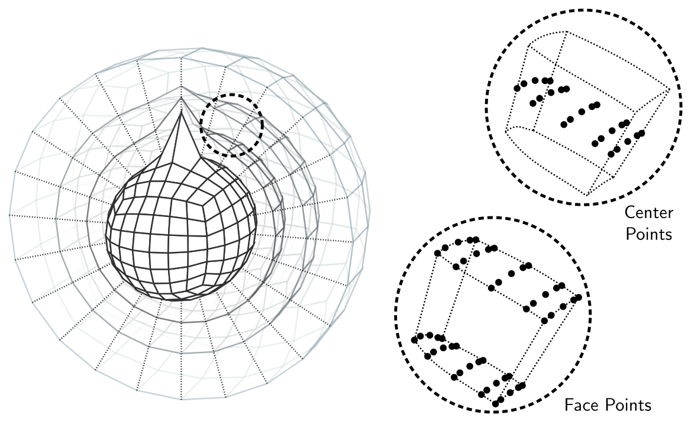

# Hybrid grids and generalized coordinates

Every ClimaCore grid is the image of a reference element under a coordinate
map, and every operator works in the reference coordinates and converts with
the metric terms of that map. This page defines the bases and metric terms
that appear throughout the library, describes how the cubed sphere and
terrain-following vertical coordinates fit the same description, and
explains why vector fields carry a basis with them. The general tensor
calculus follows [Kajishima17a](@cite); the atmosphere paper
[Yatunin2026](@cite) states the equations of motion in these coordinates.

## Reference and physical coordinates

An element of a horizontal grid is the image of the reference square
`ξ = (ξ¹, ξ²) ∈ [-1, 1]²`; a cell of an extruded grid is the image of the
reference cube `(ξ¹, ξ², ξ³)`. The map `x = r(ξ)` is bilinear for a plane, the
equiangular gnomonic projection of a cube face for the sphere
[Sadourny72a, Ronchi1996](@cite), and, in the vertical, the composition of a
stretching function with a terrain-following transformation. Two bases are
attached to every point of the physical domain:

- the **covariant basis** `e_i = ∂r/∂ξⁱ`, tangent to the coordinate lines;
- the **contravariant basis** `eⁱ = ∇ξⁱ`, normal to the coordinate surfaces.

They are dual, `e_i ⋅ eʲ = δᵢʲ`, and coincide only where the map is
orthogonal and unit-scaled. A vector `u` has covariant components
`u_i = u ⋅ e_i` and contravariant components `uⁱ = u ⋅ eⁱ`, related by the
metric tensor `g_ij = e_i ⋅ e_j` and its inverse `gⁱʲ`: `uⁱ = gⁱʲ u_j`. The
Jacobian determinant `J = √det g` converts reference volumes to physical
volumes, and the quadrature weight times `J` is the discrete volume of a node.

The figure on the [Mathematical framework](math_framework.md) page shows both
bases on a terrain-following grid.

The **local geometry** stored at every node of a grid holds the coordinates,
`J`, the Jacobian matrix `∂x/∂ξ` and its inverse, and the metric tensors.
`Fields.local_geometry_field(space)` exposes it; the operators read it
implicitly.

## Vector types

Because the bases vary from node to node, a vector component has meaning
only together with its basis. ClimaCore therefore represents vectors by typed
components:

- `Geometry.Covariant12Vector`, `Covariant3Vector`, `Covariant123Vector`
  (`C12`, `C3`, `C123`): covariant components. The prognostic velocity of the
  atmosphere is stored this way: `u₁, u₂` on centers, `u₃` on faces.
- `Geometry.Contravariant12Vector`, `Contravariant3Vector`, `Contravariant123Vector`
  (`CT12`, `CT3`, `CT123`): contravariant components, the natural form for
  a flux through a coordinate surface. Their units are reference coordinate
  per second, not meters per second.
- `Geometry.UVVector`, `WVector`, `UVWVector`: components in the local
  orthonormal frame, zonal, meridional, and radial on the sphere, `x`, `y`,
  `z` in a box. This is the frame in which physical quantities are set and
  read, and in which DSS averages vectors across element boundaries, where
  the covariant bases of neighboring elements differ.
- `Geometry.Cartesian123Vector` and related types: a single global Cartesian
  frame, used for output and visualization.

Conversions between these types are constructors that take the local
geometry, `Geometry.Contravariant3Vector(u, local_geometry)`, and the
operators perform them internally: a `Divergence` accepts a vector in any
basis and converts it to contravariant components before differencing; a
`Gradient` returns covariant components. Writing a model consists largely of
choosing which components each term needs; the
[introduction tutorial](../tutorials/introduction.md) shows the conversions in
use.

## Differential operators in generalized coordinates

With the metric terms in hand, the continuous operators take the forms the
discrete operators implement,

```math
(\nabla \psi)_i = \frac{\partial \psi}{\partial \xi^i}, \qquad
\nabla \cdot u = \frac{1}{J} \frac{\partial (J u^i)}{\partial \xi^i}, \qquad
(\nabla \times u)^i = \frac{1}{J} \epsilon^{ijk} \frac{\partial u_k}{\partial \xi^j}.
```

The gradient of a scalar is covariant, the divergence needs contravariant
components, and the curl maps covariant components to contravariant ones,
which fixes the input and output types of `Gradient`, `Divergence`, and
`Curl`. The divergence of a tensor (the momentum flux) would need Christoffel
symbols in this form; ClimaCore avoids them by converting the tensor to a
Cartesian frame, differencing, and converting back [Vinokur74a](@cite), or,
in the atmosphere, by writing momentum advection in vector-invariant form so
that only scalar gradients and curls of vectors appear.

The metric terms `∂x/∂ξ` are computed at grid construction. For the cubed
sphere, they are obtained by forward-mode automatic differentiation of the
coordinate map (the `autodiff_metric` keyword of `SpectralElementGrid2D`,
on by default), which gives them to round-off rather than to the accuracy of
a spectral derivative of the nodal coordinates. A free-stream-preserving
discrete metric is what makes a uniform flow stay uniform on a curved grid
[Kopriva06a](@cite).

## The cubed sphere

The sphere is covered by six panels, each the gnomonic image of a cube face
divided into `Ne × Ne` elements with equiangular spacing
[Sadourny72a, Ronchi1996](@cite). Element edges are great-circle arcs, the
map is smooth within a panel, and the coordinate directions are discontinuous
across panel edges, which is why vectors must be averaged in the orthonormal
frame during DSS. `Meshes.EquiangularCubedSphere(domain, Ne)` builds the mesh;
`Meshes.EquidistantCubedSphere` and `Meshes.ConformalCubedSphere` are the
alternatives.



*A shallow extruded cubed-sphere grid with a large mountain at a pole, and the
nodes of one element: the 5 × 5 Gauss–Lobatto–Legendre points of a
degree-4 element on each of three levels, at the cell centers (top) and at the
cell faces (bottom). Element
edges follow the terrain-following levels. From [Yatunin2026](@cite).* The horizontal resolution is set by `Ne` and the polynomial
degree: with `Ne = 30` and `Nq = 4` the average node spacing is about 103 km,
with `Ne = 120` about 26 km [Yatunin2026](@cite).

Two global geometries are available. `Geometry.DeepSphericalGlobalGeometry`
keeps the radial dependence of the metric, so that a shell of thickness `zₜ`
above radius `R` has its physical volume, and the Coriolis force has its full
three-dimensional form. `Geometry.ShallowSphericalGlobalGeometry` evaluates
the horizontal metric at `R` at every height, the shallow-atmosphere
approximation [White05a](@cite).

## Terrain-following vertical coordinates

An extruded grid is the image of the reference cube under a map that is the
identity in the horizontal reference coordinates and, in the vertical, the
composition of two one-dimensional transformations:

```math
z(\xi^1, \xi^2, \xi^3) = Z\bigl(z_\mathrm{ref}(\xi^3),\, h(\xi^1, \xi^2)\bigr),
\qquad z_\mathrm{ref} = z_\mathrm{top}\, \zeta(\xi^3),
```

where `ζ` is the stretching, `h` the surface elevation, and `Z` the
terrain-following adaption. Levels are uniform in `ξ³`; the vertical grid
constructor places the `Nv + 1` faces at `z_ref` and the adaption warps them.

**Stretching** (`Meshes.StretchingRule`) concentrates levels near the
surface. With `η = z_ref / z_top` the implemented rules are

```math
\text{Uniform:}\quad \eta = \xi^3, \qquad
\text{Exponential:}\quad \xi^3 = \frac{1 - e^{-\eta/\hat h}}{1 - e^{-1/\hat h}},\ \hat h = \frac{H}{z_\mathrm{top}}, \qquad
\text{Hyperbolic tangent:}\quad \eta = 1 - \frac{\tanh\bigl(\gamma (1 - \xi^3)\bigr)}{\tanh \gamma},
```

with `H` a scale height (`Meshes.ExponentialStretching(H)`) and `γ` solved so
that the lowest cell has a prescribed height `dz_surface`
(`Meshes.HyperbolicTangentStretching(dz_surface)`);
`Meshes.GeneralizedExponentialStretching(dz_bottom, dz_top)` fits an
exponential to two target spacings. The CliMA atmosphere uses hyperbolic
tangent stretching with a 30 m surface cell, `γ ≈ 2.8` for 43 levels in a 30 km
domain [Yatunin2026](@cite).

**Adaption** (`Hypsography.HypsographyAdaption`). The Gal-Chen map
(`Hypsography.LinearAdaption(z_surface)`) displaces each level by a fraction of
the terrain height that decreases linearly to zero at the top
[GalChen1975](@cite):

```math
Z = z_\mathrm{ref} + \left(1 - \frac{z_\mathrm{ref}}{z_\mathrm{top}}\right) h .
```

The SLEVE map (`Hypsography.SLEVEAdaption(z_surface, ηₕ, s)`) decays the
displacement with a hyperbolic sine and removes it above the reference height
`ηₕ z_top`, so that the upper levels are flat [Schar2002](@cite):

```math
Z = \eta\, z_\mathrm{top} + h\, \frac{\sinh\bigl((\eta_h - \eta)/(s\,\eta_h)\bigr)}{\sinh(1/s)}
\ \ (\eta \le \eta_h), \qquad Z = \eta\, z_\mathrm{top}\ \ (\eta > \eta_h),
```

with `ηₕ ∈ [0, 1]` and the decay scale `s` a fraction of `z_top`; the map is
one-to-one when `s z_top` exceeds the maximum of `h`, which the constructor
checks. Both maps reduce to `Z = z_ref` where `h = 0`.

**Metric terms of the map.** Writing `∂_i` for `∂/∂ξⁱ`, and taking a
Cartesian domain with `x = x(ξ¹)`, `y = y(ξ²)` for definiteness (on the sphere
the horizontal factors are those of the panel map), the vertical covariant
basis vector is
`e_3 = ∂_3 z\, \widehat{k}`, aligned with the vertical, while the horizontal
covariant vectors acquire a vertical component, `e_1 = ∂_1 x\, \widehat{\imath} + ∂_1 z\, \widehat{k}`
(and likewise `e_2`): the coordinate lines follow the terrain. The
contravariant vectors are the reverse: `e¹` and `e²` stay horizontal, and
`e³ = ∇ξ³` tilts,

```math
e^3 = \frac{1}{\partial_3 z}\left(\widehat{k} - \frac{\partial_1 z}{\partial_1 x}\,\widehat{\imath} - \frac{\partial_2 z}{\partial_2 y}\,\widehat{\jmath}\right),
\qquad J = \partial_1 x\, \partial_2 y\, \partial_3 z ,
```

so the metric components `g^{31} = e^3 ⋅ e^1` and `g^{32} = e^3 ⋅ e^2` are
proportional to the slopes `∂_1 z`, `∂_2 z` of the level surfaces and vanish
where the levels are flat. For the Gal-Chen map `∂_3 z = (dz_ref/dξ³)(1 −
h/z_top)` and `∂_1 z = (1 − z_ref/z_top)\, ∂_1 h`, so the tilt persists to the
top; for SLEVE it is zero above `ηₕ z_top`. `Fields.local_geometry_field`
stores `∂x/∂ξ`, its inverse, `J`, and `gⁱʲ` at every node, evaluated by
forward-mode differentiation of the map.

**Consequences.** The contravariant vertical velocity is the flow through a
level surface,

```math
u^3 = \frac{1}{\partial_3 z}\left(w - u\, \frac{\partial_1 z}{\partial_1 x} - v\, \frac{\partial_2 z}{\partial_2 y}\right),
```

so the no-flow condition at the surface `ξ³ = 0` is `u³ = 0`, which is
`w = u ⋅ ∇h` in Cartesian components: the flow follows the terrain. The
atmosphere's prognostic velocity uses the covariant `u₃`, and the boundary
condition fixes it from `u₁, u₂` through `u³ = g³¹ u₁ + g³² u₂ + g³³ u₃ = 0`.
Steep, unsmoothed terrain produces large `∂_1 z`, hence large `g³¹`, and a
spurious horizontal pressure-gradient error;
`Hypsography.diffuse_surface_elevation!` smooths a surface-elevation field
before it is used. The consistency of the discrete metric terms across the
horizontal and vertical operators determines whether a resting atmosphere
stays at rest over terrain [Klemp03a](@cite); alternative smoothed
coordinates are discussed by [Klemp11a, Leuenberger10q](@cite). [Use
terrain-following coordinates](../howto/topography.md) shows the constructors
and an executed stretching example.
