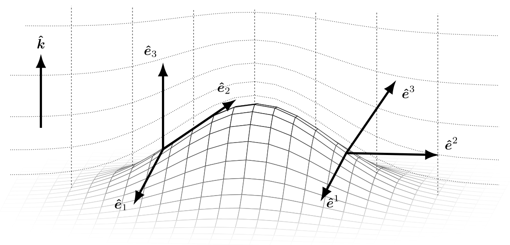

# Mathematical framework

ClimaCore represents scalar and vector fields on a discretized domain and
evaluates differential operators on them. Two ideas run through the whole
library. First, every grid is the image of a reference element under a
coordinate map, so vectors carry a basis with them and operators are written
in the coordinates of the reference element. Second, the horizontal
discretization is a Galerkin method on a nodal polynomial space, so the
operators come in a strong and a weak form and conservation follows from the
pairing of the two. This page introduces both ideas and fixes the notation
that the other explanation pages use.

## Vectors and bases

A physical vector has a direction and a magnitude; its components are numbers
that depend on the basis they are taken in. On a curved or stretched grid the
natural bases vary from point to point, so a component has meaning only
together with the basis at that point. ClimaCore therefore stores vectors as
typed components (`Geometry.Covariant12Vector`, `Geometry.UVWVector`, …) and
converts between bases with the local geometry of the node.

### The local orthonormal basis

The simplest basis is the local orthonormal frame, written `UVW`:

  - in a Cartesian domain, it is the fixed Cartesian basis, `U` along `x`, `V`
    along `y`, `W` along `z`;
  - on the sphere, it is the frame of spherical coordinates, `U` eastward
    (zonal), `V` northward (meridional), `W` radially outward.

Its components have physical units and a direct interpretation, and `U`, `V`
are horizontal and `W` vertical in every domain, so model code written in
terms of them runs on a box and on the sphere alike. The types are
`Geometry.UVector`, `UVVector`, `WVector`, `UVWVector`, and the two-component
mixtures `UWVector`, `VWVector`. Physical quantities are set and read in this
basis, and it is the basis in which direct stiffness summation averages
vectors across element boundaries.

### Covariant and contravariant bases

The differential operators do not work in the orthonormal frame. Each
element is the image of a reference element under a map `x = r(ξ)` with
reference coordinates `ξ = (ξ¹, ξ², ξ³)`, and two bases are attached to every
point of the image:

```math
\mathbf e_i = \frac{\partial \mathbf r}{\partial \xi^i}
\quad \text{(covariant, tangent to the coordinate lines)}, \qquad
\mathbf e^i = \nabla \xi^i
\quad \text{(contravariant, normal to the coordinate surfaces)}.
```

They are dual, `e_i ⋅ eʲ = δᵢʲ`, and coincide only where the map is orthogonal
and unit-scaled. A vector `u` has covariant components `u_i = u ⋅ e_i` and
contravariant components `uⁱ = u ⋅ eⁱ`, so that `u = uⁱ e_i = u_i eⁱ`, and the
two sets are related by the metric tensor,

```math
g_{ij} = \mathbf e_i \cdot \mathbf e_j, \qquad g^{ij} = \mathbf e^i \cdot \mathbf e^j, \qquad
u^i = g^{ij} u_j, \qquad u_i = g_{ij} u^j .
```

The Jacobian determinant `J = √det g` converts reference volumes to physical
volumes.



*A stretched terrain-following grid over a mountain. Dotted lines are the
coordinate surfaces `ξ³ = const` (levels) and `ξ¹ = const` (columns); `k̂` is
the vertical unit vector. The covariant basis vectors `ê₁`, `ê₃` are tangent
to the coordinate lines, so over the slope `ê₃` follows the tilted column; the
contravariant basis vectors `ê¹`, `ê²`, `ê³` are normal to the coordinate
surfaces, so `ê³` is normal to the level. On flat ground the two bases
coincide; over the slope they differ, and the metric terms `g³¹, g³²` relate
them. From [Yatunin2026](@cite).*

The operators fix which components they take and return. A gradient of a
scalar is naturally covariant, `(∇ψ)_i = ∂ψ/∂ξⁱ`; a divergence needs
contravariant components, `∇ ⋅ u = J⁻¹ ∂(J uⁱ)/∂ξⁱ`, because `J uⁱ` is the flux
through a coordinate surface; a curl maps covariant to contravariant
components. `Operators.Gradient` therefore returns a covariant vector and
`Operators.Divergence` converts its argument to contravariant components
before differencing. Because the bases are specific to an element and to a
node, comparing or averaging covariant components of neighboring elements
goes through the orthonormal frame first. Conversions are constructors that
take the node's `Geometry.LocalGeometry`, which the grid stores at every
node; [Hybrid grids and generalized coordinates](geometry.md) gives the
metric terms of the cubed sphere and of terrain-following coordinates and
the operator forms in full.

## The Galerkin discretization

### Strong and weak forms

A differential equation can be imposed pointwise (its *strong* form) or
after multiplication by a test function `v` and integration over the domain
(its *weak* form). For the Poisson problem `−∇²u = f` on `Ω`, multiplying by
`v` and integrating by parts gives

```math
\int_\Omega \nabla v \cdot \nabla u \, dV
  - \int_{\partial \Omega} v\, \nabla u \cdot \widehat{\mathbf n}\, dS
  = \int_\Omega v f \, dV ,
```

which asks one derivative less of `u` and moves a derivative onto `v`. A
*Galerkin* method seeks `u` in a finite-dimensional space `V_h` and requires
the weak form to hold for every `v ∈ V_h`. The boundary integral is where
boundary conditions enter, and it vanishes when the normal flux is
prescribed to be zero or when the domain is periodic.

### The spectral-element space

A spectral-element space is a Galerkin space built from a partition of the
domain into elements `Ω_e` [Karniadakis05a, Deville02a](@cite). Within each
element a function is a polynomial of degree `Nq − 1` in each reference
direction, represented by its values at `Nq` nodes per direction: the basis is
*nodal*, a tensor product of Lagrange interpolating polynomials `L_n(ξ)` that
equal one at node `ζ_n` and zero at the other nodes. Restricting the
polynomials to single elements, rather than interpolating globally, keeps the
coupling between degrees of freedom local, so that no dense global system
arises when element contributions are summed.

The nodes are chosen to be the points of a quadrature rule, so that the same
nodes that carry the function also integrate it (*collocation*):

```math
\int_{\Omega_e} \psi\, dV \approx \sum_{n} w_n\, J_n\, \psi_n .
```

With this rule the mass matrix `∫ L_m L_n J dξ` is diagonal, the weak form of
a derivative becomes an explicit nodal formula, and the product `WJ = w J`
at a node is its discrete volume and the weight of every integral and inner
product in the library. ClimaCore's default rule is Gauss–Lobatto–Legendre
(`Quadratures.GLL{Nq}`), whose nodes include the element endpoints; nodes on
element boundaries are then shared between neighbors, which is what a
continuous (CG) function space needs. Gauss–Legendre nodes
(`Quadratures.GL{Nq}`) lie strictly inside the element, and a grid on them is
discontinuous.

How the element-local weak form is assembled into a global operator, by
direct stiffness summation on a continuous space or by interface numerical
fluxes on a discontinuous one, and which form of each operator a
conservation law requires, is the subject of [Spectral elements: CG and
DG](discretizations.md). The vertical direction is discretized differently,
by finite differences on a staggered grid; [Staggered vertical
discretization](vertical.md) gives those operators.

## Notation

The explanation pages use the following symbols.

| Symbol                       | Meaning                                                                                         |
|:---------------------------- |:----------------------------------------------------------------------------------------------- |
| `ξ = (ξ¹, ξ², ξ³)`           | Reference coordinates; `ξ¹, ξ²` in `[−1, 1]` within a horizontal element, `ξ³` along the column |
| `x = r(ξ)`                   | Coordinate map from the reference element to the physical domain                                |
| `e_i`, `eⁱ`                  | Covariant and contravariant basis vectors                                                       |
| `u_i`, `uⁱ`                  | Covariant and contravariant components of `u`                                                   |
| `g_ij`, `gⁱʲ`                | Metric tensor and its inverse                                                                   |
| `J`                          | Jacobian determinant of the coordinate map                                                      |
| `Nq`, `ζ_n`, `w_n`           | Nodes per direction of an element, node positions, quadrature weights                           |
| `WJ`                         | Quadrature weight times Jacobian at a node: its discrete volume                                 |
| `L_n(ξ)`, `D_mn`             | Lagrange basis polynomials and the differentiation matrix `D_mn = L_n′(ζ_m)`                    |
| `∇ₕ`, `∇ₕ ⋅`, `∇ₕ ×`         | Horizontal spectral-element gradient, divergence, curl                                          |
| `∂̃`, `Divergence{WeakForm}` | A weak-form operator: the negative adjoint of the strong form under the `WJ` inner product      |
| `𝒫`                          | Direct stiffness summation (DSS), the projection onto the continuous space                      |
| `F*(y⁻, y⁺; n̂)`             | A numerical flux at a DG face, from the states on the two sides and the outward normal          |
| `i`, `i + ½`                 | Cell-center and cell-face positions of the vertical grid (`PlusHalf` indices in code)           |
| `C2F`, `F2C`                 | Finite-difference operators from centers to faces and from faces to centers                     |
