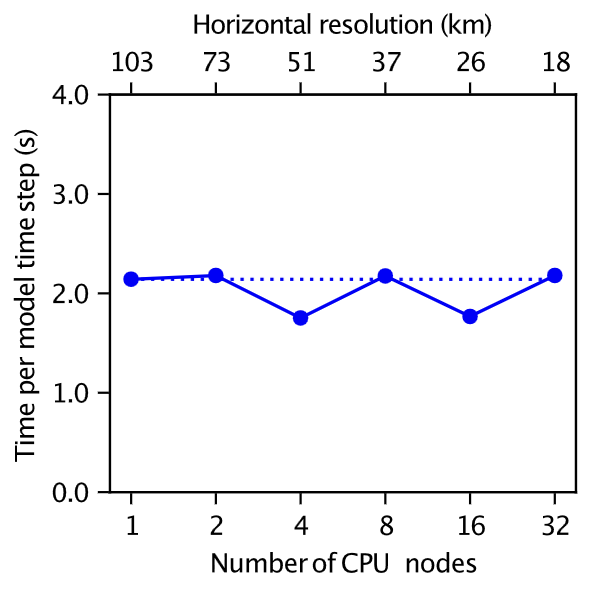
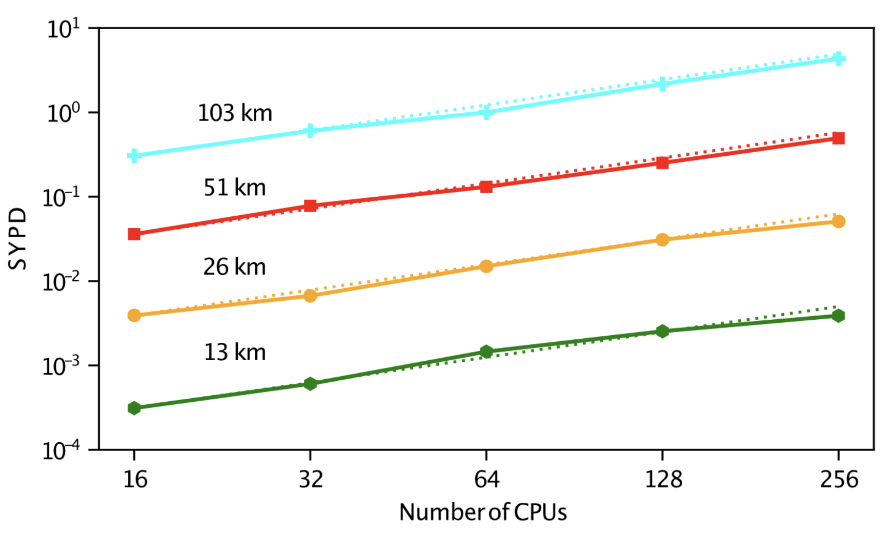

# Performance and portability

ClimaCore runs on CPUs and on NVIDIA GPUs.
This page describes how that portability is achieved, what the measured
performance of the atmosphere built on it is, and where the costs are. The
baseline numbers are those of [Yatunin2026](@cite), measured in September 2025
with the CliMA atmosphere (ClimaAtmos) in its moist baroclinic-wave
configuration with 43 vertical levels. A more recent
assessment on Derecho, after performance improvements, covers only a subset of those GPU measurements; no additional CPU scaling checks were run.

## How portability is achieved

**One kernel language.** Model code is written as broadcast expressions over
fields ([Operators and broadcasting](operators.md)). On a CPU, a fused
expression compiles to a loop; when the fields live on a `ClimaComms.CUDADevice`,
the same expression compiles to a CUDA kernel through the `ClimaCoreCUDAExt`
package extension, which loads when CUDA.jl is present. Every kernel assigns one thread per
nodal point. Finite-difference kernels give a column to a group of threads
along its levels; spectral-element kernels give each element slab a group of
threads, one per node, pack several slabs into a thread block, and stage the
slab in shared memory for the differentiation matrix. Kernels are specialized
on the polynomial degree, so the loops over quadrature nodes unroll.

**Device-agnostic data.** A field's storage is an array whose type follows the
device (`Array` or `CuArray`), and every grid, space, and operator is
`Adapt`-able, so a model state moves between devices with
`ClimaCore.to_device`. Halo exchanges for DSS and for DG face fluxes go through
`ClimaComms`, which dispatches on the context type: a no-op on one process,
MPI messages on many, GPU-aware where the MPI library supports it.

**Memory layout.** Field data is stored in one of the `DataLayouts`: `VIJFH`
orders vertical level, the two horizontal node indices, the components of the
value type, and the element index from fastest to slowest; `VIJHF` swaps the
last two. The choice is a type parameter of the space (`VIJH` keyword), and
the horizontal element index is the slowest so that one element is contiguous
in memory. Elements are ordered along a space-filling curve
(`Topologies.spacefillingcurve`) so that spatial neighbors are memory
neighbors [Cerveny24a](@cite).

**Precision.** Every grid and field is parameterized on its float type; there
are no separate `Float32` and `Float64` code paths. In the atmosphere's
year-long conservation test, the relative drift of dry mass and total water is
of order 10⁻¹³ in `Float64` and 10⁻⁴ in `Float32` [Yatunin2026](@cite).

## Measured throughput and scaling

The table below mixes the published measurements of [Yatunin2026](@cite)
(September 2025) with a September 2026 A100 re-check on Derecho. Hardware:
NCAR's Derecho (four NVIDIA A100 GPUs per node), Google Cloud Platform NVIDIA
H100 instances, and Caltech's Resnick cluster (two 32-core Intel Icelake CPUs
per node, 16 MPI ranks per node).

The 2026 GPU figures overlay recent scaling measurements onto the published results. The 2026
runs cover only a subset of the published measurements: A100 strong scaling at
103 km and 51 km, and the two matching weak-scaling points (helem 30 on 1 GPU
and helem 60 on 4 GPUs, about 5400 spectral elements per GPU). CPU scaling measurements remain the 2025 result.

| Quantity                                  | Result                                                                                                                             |
|:----------------------------------------- |:---------------------------------------------------------------------------------------------------------------------------------- |
| Weak scaling, 103 km → 6 km, 1 → 256 GPUs | Efficiency above 92% on GPUs; time per step stays near the 1-GPU value of 223 ms (Sep 2025)                                        |
| Weak scaling on CPUs, 16 → 512 ranks      | Efficiency above 98%, time per step near 2 s (Sep 2025; not re-run in 2026)                                                        |
| Strong scaling on GPUs                    | Efficiency above 95% while each GPU holds at least about 5400 spectral elements (Sep 2025); 2026 A100 re-check at 103 km and 51 km |
| Strong scaling on CPUs                    | About 80% at the highest resolution, up to 16 nodes (Sep 2025; not re-run in 2026)                                                 |
| Throughput at 25–50 km                    | More than 1 simulated year per day on a dozen to a few dozen GPUs                                                                  |
| Throughput at 6 km, 256 H100 GPUs         | 0.20 simulated years per day, with one-moment microphysics (Sep 2025)                                                              |
| Time per step at 51 km on 4 A100 GPUs     | About 0.22 s (Sep 2025); 0.155 s (Sep 2026 A100 re-check)                                                                          |

*GPU weak scaling on Derecho A100s. Dashed navy: September 2025 published
ladder (103 km to 6 km). Solid grey: September 2026 re-check at the two
overlapping points (103 km on 1 GPU, 51 km on 4 GPUs). Dotted lines are the
single-GPU time for each campaign.*

*GPU strong scaling, simulated years per day. Hollow markers and solid lines:
published results on H100 (GCP). Filled dashed lines: published results on A100 (Derecho).
Grey solid lines: September 2026 A100 re-check at 103 km and 51 km. Dotted
lines are ideal strong scaling from the 2025 H100 1-GPU (or few-GPU) points.
The A100 curves at 26 km, 13 km, and 6 km — and all H100 curves — are 2025
published data. The GPU results use recent versions of ClimaCore and ClimaAtmos.*

*CPU weak scaling on Caltech's Resnick cluster (16 MPI ranks per node),
published results from Yatunin et al. (2026). Time per model step
stays near 2 s as the problem and rank count grow together from 1 to 32 nodes
(103 km to 18 km), for efficiency above 98% from 16 to 512 ranks. The dotted
line marks the single-node time. These CPU results use an earlier package
version than the latest release.*

*CPU strong scaling, simulated years per day against MPI rank count at fixed
resolution, published results from Yatunin et al. (2026). Solid lines are
measured throughput at 103 km, 51 km, 26 km, and 13 km; dotted
lines are ideal strong scaling. Efficiency holds near 80% at the highest
resolution up to 16 nodes (256 ranks). These CPU results use an earlier
package version than the latest release.*

The runs behind these figures are ClimaAtmos configurations. The GPU
figures are drawn by
[`plot_scaling_2026.jl`](https://github.com/CliMA/ClimaAtmos.jl/blob/main/plot_scaling_2026.jl)
in the ClimaAtmos repository. The 2025 published CPU plots were produced by
[`miscellaneous/CPU_mbw_scaling_plots.jl`](https://github.com/CliMA/ClimaAtmos.jl/blob/main/miscellaneous/CPU_mbw_scaling_plots.jl).
The moist baroclinic-wave benchmark itself is
[`config/longrun_configs/longrun_moist_baroclinic_wave_he60.yml`](https://github.com/CliMA/ClimaAtmos.jl/blob/main/config/longrun_configs/longrun_moist_baroclinic_wave_he60.yml)
and its dry counterpart in the same directory. The earlier CI-oriented
helpers remain at
[`post_processing/plot_gpu_weak_scaling.jl`](https://github.com/CliMA/ClimaAtmos.jl/blob/main/post_processing/plot_gpu_weak_scaling.jl),
[`post_processing/plot_gpu_strong_scaling.jl`](https://github.com/CliMA/ClimaAtmos.jl/blob/main/post_processing/plot_gpu_strong_scaling.jl),
and
[`post_processing/plot_gpu_scaling_utils.jl`](https://github.com/CliMA/ClimaAtmos.jl/blob/main/post_processing/plot_gpu_scaling_utils.jl).

For context, the same paper compares against two other GPU dynamical cores:
SCREAM (C++/Kokkos) reports 0.52 simulated years per day at 3.25 km on 1536
A100 GPUs [Donahue24a](@cite), which after accounting for the roughly eightfold
cost of halving the resolution is a comparable throughput per GPU, and Pace
(Python) reports 3.98 s per step at about 50 km on 6 P100 GPUs
[Dahm23a](@cite). H100 instances give the higher throughput at small GPU
counts; Derecho's interconnect gives the better scaling efficiency, so several
A100s match or exceed the H100 instances at high GPU counts. The point of the
cloud measurements is access: a few dozen cloud GPUs run a global simulation
at 25–50 km resolution faster than real time, without a supercomputer
allocation.

## Where the time goes

DSS is the only horizontal communication in a CG model and one of two
exchanges (with the DG halo) in a DG model; everything else is element- or
column-local. The vertical implicit solve is column-local and needs no
communication. At fixed resolution, the per-step cost is dominated by kernel
execution when each GPU holds thousands of elements and by launch and exchange
latency when it holds few, which is the knee in the strong-scaling curves.
Over-aggressive fusion of a long tendency into one kernel spills registers or
exhausts shared memory and slows the kernel; the split points are chosen by
measurement.

Four environment variables tune the GPU kernel launches; the
[Environment variables](../reference/environment.md) page lists them, and
[`perf/sweep_kernel_configs.jl`](https://github.com/CliMA/ClimaCore.jl/blob/main/perf/sweep_kernel_configs.jl) sweeps them.
For writing new code that keeps these properties (no allocation in kernels,
type stability, `ifelse` over branches), see the shared developer guides under
[`docs/dev-guides/performance/`](https://github.com/CliMA/ClimaCore.jl/tree/main/docs/dev-guides/performance).
