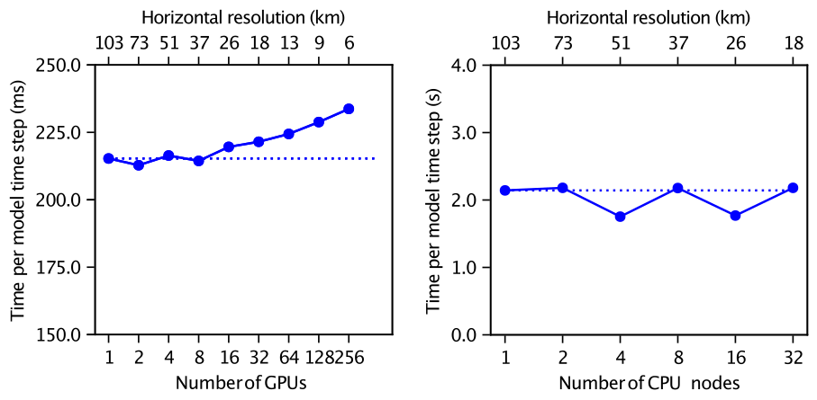
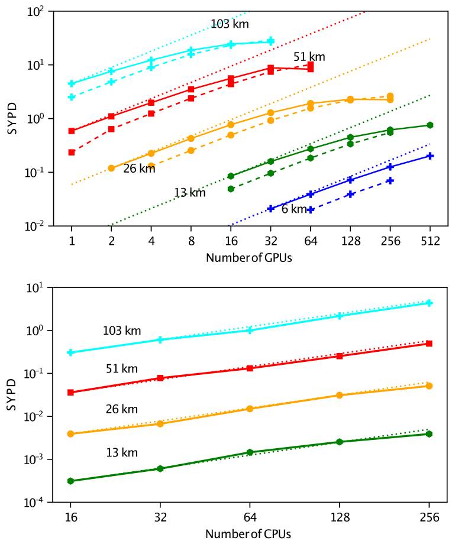

# Performance and portability

ClimaCore runs one source on CPUs and on NVIDIA GPUs, on one process or many.
This page describes how that portability is achieved, what the measured
performance of the atmosphere built on it is, and where the costs are. The
numbers are those of [Yatunin2026](@cite), measured with the CliMA atmosphere
(ClimaAtmos) in its moist baroclinic-wave configuration with 43 vertical
levels; they characterize the whole model, of which ClimaCore's operators are
the dominant part. The portability design continues that of ClimateMachine,
whose large-eddy simulations ran on GPUs and CPUs from one Julia source
[Sridhar22a](@cite).

## How portability is achieved

**One kernel language.** Model code is written as broadcast expressions over
fields ([Operators and broadcasting](operators.md)). On a CPU, a fused
expression compiles to a loop; when the fields live on a `ClimaComms.CUDADevice`
the same expression compiles to a CUDA kernel through the `ClimaCoreCUDAExt`
package extension, which loads when CUDA.jl is present. Pointwise and
finite-difference kernels assign one thread per nodal point; spectral-element
kernels assign one thread per horizontal slice of an element and hold the
element's nodes in shared memory. Kernels are specialized on the polynomial
degree, so the loops over quadrature nodes unroll.

**Device-agnostic data.** A field's storage is an array whose type follows the
device (`Array` or `CuArray`), and every grid, space, and operator is
`Adapt`-able, so a model state moves between devices with
`ClimaCore.to_device`. Halo exchanges for DSS and for DG face fluxes go through
`ClimaComms`, which dispatches on the context type: a no-op on one process,
MPI messages on many, GPU-aware where the MPI library supports it.

**Memory layout.** Field data is stored in one of the `DataLayouts`: `VIJFH`
orders vertical level, the two horizontal node indices, the components of the
value type, and the element index from fastest to slowest; `VIJHF` swaps the
last two. The choice is a type parameter of the space (`VIJH` keyword), and
the horizontal element index is the slowest so that one element is contiguous
in memory. Elements are ordered along a space-filling curve
(`Topologies.spacefillingcurve`) so that spatial neighbors are memory
neighbors [Cerveny24a](@cite).

**Precision.** Every grid and field is parameterized on its float type;
`Float32` and `Float64` runs use the same code. In the atmosphere's
year-long conservation test, the relative drift of dry mass and total water is
of order 10⁻¹³ in `Float64` and 10⁻⁴ in `Float32` [Yatunin2026](@cite).

## Measured throughput and scaling

Hardware in the measurements: NCAR's Derecho (four NVIDIA A100 GPUs per
node), Google Cloud Platform NVIDIA H100 instances, and Caltech's Resnick
cluster (two 32-core Intel Icelake CPUs per node, 16 MPI ranks per node).

| Quantity                                                   | Result                                                                                  |
|:-----------------------------------------------------------|:----------------------------------------------------------------------------------------|
| Weak scaling, 103 km → 6 km, 1 → 256 GPUs                  | Efficiency above 92% on GPUs; time per step stays near the 1-GPU value of 223 ms        |
| Weak scaling on CPUs, 16 → 512 ranks                       | Efficiency above 98%                                                                    |
| Strong scaling on GPUs                                     | Efficiency above 95% while each GPU holds at least about 5400 spectral elements         |
| Strong scaling on CPUs                                     | About 80% at the highest resolution, up to 16 nodes                                     |
| Throughput at 25–50 km                                     | More than 1 simulated year per day on a dozen to a few dozen GPUs                       |
| Throughput at 6 km, 256 H100 GPUs                          | 0.20 simulated years per day, with one-moment microphysics                              |
| Time per step at 51 km on 4 A100 GPUs                      | About 0.22 s                                                                            |

*Weak scaling: time per model step as the resolution is refined from 103 km to
6 km while the number of GPUs (left) or CPU nodes (right, 16 ranks per node)
doubles at each step. The dotted line is the single-device time. From
[Yatunin2026](@cite).*

*Strong scaling: simulated years per day at fixed resolution against the number
of GPUs (top; solid lines GCP H100, dashed lines Derecho A100, dotted lines
ideal) and CPUs (bottom). From [Yatunin2026](@cite).*

The runs behind these figures are ClimaAtmos configurations; the scripts that
launch the scaling sweeps and draw the plots live in the ClimaAtmos repository:
[`post_processing/plot_gpu_weak_scaling.jl`](https://github.com/CliMA/ClimaAtmos.jl/blob/main/post_processing/plot_gpu_weak_scaling.jl),
[`post_processing/plot_gpu_strong_scaling.jl`](https://github.com/CliMA/ClimaAtmos.jl/blob/main/post_processing/plot_gpu_strong_scaling.jl),
[`post_processing/plot_scaling_results.jl`](https://github.com/CliMA/ClimaAtmos.jl/blob/main/post_processing/plot_scaling_results.jl),
with the shared helpers in
[`post_processing/plot_gpu_scaling_utils.jl`](https://github.com/CliMA/ClimaAtmos.jl/blob/main/post_processing/plot_gpu_scaling_utils.jl)
and the strong-scaling configuration
[`config/gpu_configs/gpu_aquaplanet_dyamond_ss.yml`](https://github.com/CliMA/ClimaAtmos.jl/blob/main/config/gpu_configs/gpu_aquaplanet_dyamond_ss.yml).
The moist baroclinic-wave benchmark itself is
[`config/longrun_configs/longrun_moist_baroclinic_wave_he60.yml`](https://github.com/CliMA/ClimaAtmos.jl/blob/main/config/longrun_configs/longrun_moist_baroclinic_wave_he60.yml)
and its dry counterpart in the same directory.

For context, the same paper compares against two other GPU dynamical cores:
SCREAM (C++/Kokkos) reports 0.52 simulated years per day at 3.25 km on 1536
A100 GPUs [Donahue24a](@cite), which after accounting for the roughly eightfold
cost of halving the resolution is a comparable throughput per GPU, and Pace
(Python) reports 3.98 s per step at about 50 km on 6 P100 GPUs
[Dahm23a](@cite). H100 instances give the higher throughput at small GPU
counts; Derecho's interconnect gives the better scaling efficiency, so several
A100s match or exceed the H100 instances at high GPU counts. The point of the
cloud measurements is access: a few dozen cloud GPUs run a global simulation
at 25–50 km resolution faster than real time, without a supercomputer
allocation.

## Where the time goes

DSS is the only horizontal communication in a CG model and one of two
exchanges (with the DG halo) in a DG model; everything else is element- or
column-local. The vertical implicit solve is column-local and needs no
communication. At fixed resolution, the per-step cost is dominated by kernel
execution when each GPU holds thousands of elements and by launch and exchange
latency when it holds few, which is the knee in the strong-scaling curves.
Over-aggressive fusion of a long tendency into one kernel spills registers or
exhausts shared memory and slows the kernel; the split points are chosen by
measurement.

Four environment variables tune the GPU kernel launches (`CLIMA_CUDA_MAX_WAVES`,
`CLIMA_FD_MAX_THREADS`, `CLIMA_DSS_MAX_THREADS`, `CLIMA_COLLECT_KERNEL_STATS`);
[`perf/sweep_kernel_configs.jl`](https://github.com/CliMA/ClimaCore.jl/blob/main/perf/sweep_kernel_configs.jl) sweeps them.
For writing new code that keeps these properties (no allocation in kernels,
type stability, `ifelse` over branches), see the shared developer guides under
[`docs/dev-guides/performance/`](https://github.com/CliMA/ClimaCore.jl/tree/main/docs/dev-guides/performance).
