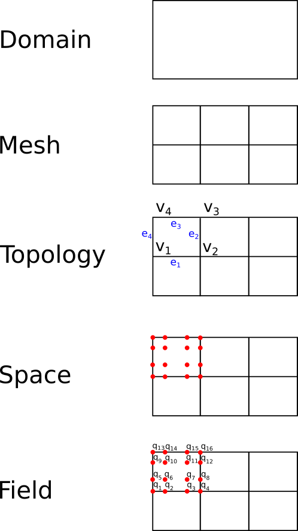

# Concepts and design

ClimaCore.jl is the layer of the CliMA Earth system model that turns a
continuous domain into discrete fields and differential operators. It is agnostic
about the medium, whether air, water, or soil: [ClimaAtmos.jl](https://clima.github.io/ClimaAtmos.jl/stable/)
and [ClimaLand.jl](https://clima.github.io/ClimaLand.jl/stable/) write their
governing equations in ClimaCore's operators and let ClimaCore evaluate them on
the chosen grid and hardware [Yatunin2026, Deck26a](@cite). ClimaCore
grew out of ClimateMachine, CliMA's first atmosphere code, whose
discontinuous-Galerkin large-eddy simulations on GPUs and CPUs
[Sridhar22a](@cite) set the requirements of portability and of a single code
from the boundary layer to the globe. This page
describes the objects a model is assembled from, the boundaries between
ClimaCore and its neighbors, and the range of configurations the same code
serves.

## The object hierarchy

A model is built from the bottom up, each object wrapping the one below it.

| Object              | Module            | What it fixes                                                                                                       |
|:--------------------|:------------------|:--------------------------------------------------------------------------------------------------------------------|
| Domain              | `Domains`         | The continuous region and its boundary names: an interval, a rectangle, or the sphere.                             |
| Mesh                | `Meshes`          | The partition of the domain into elements: interval meshes with a stretching rule, rectilinear planes, the equiangular cubed sphere [Sadourny72a, Ronchi1996](@cite). |
| Topology            | `Topologies`      | Which elements are neighbors, and which process owns which element under MPI.                                       |
| Quadrature          | `Quadratures`     | The nodes inside each element: Gauss–Lobatto–Legendre (`GLL{Nq}`, nodes on element boundaries) or Gauss–Legendre (`GL{Nq}`). |
| Grid                | `Grids`           | Topology plus quadrature plus the geometry at every node (coordinates, metric terms, Jacobian). Spectral-element grids also carry the discretization, `Grids.CG()` or `Grids.DG()`. |
| Space               | `Spaces`          | A grid plus, in the vertical, a staggering: cell centers or cell faces.                                            |
| Field               | `Fields`          | Values of one type (a scalar, a vector, or a `NamedTuple` of them) at every node of a space.                        |
| Operator            | `Operators`       | A stencil or spectral derivative that acts on fields inside a broadcast expression.                                |

```@raw html

```

*The first five layers on a rectangle of 3 × 2 elements: the domain is the
region; the mesh divides it into elements; the topology names each element's
vertices `v₁…v₄` and edges `e₁…e₄` and records which are shared with
neighbors; the space places the quadrature nodes (red) inside each element;
a field assigns a value `q₁…q₁₆` to every node.*

`Fields.FieldVector` collects fields on different spaces into one state vector
with named components, which is what a time stepper advances. The
[API overview](../reference/index.md) lists the modules; the
[introduction tutorial](../tutorials/introduction.md) walks through the
hierarchy with code.

## Two horizontal discretizations, one vertical

Horizontal grids are spectral elements: within each element a field is a
polynomial of degree `Nq - 1` in each reference direction, represented by its
values at the `Nq × Nq` quadrature nodes. Two ways of coupling neighboring
elements are available and are chosen per grid:

- **Continuous Galerkin (CG)**, `Grids.CG()`: node values on shared element
  boundaries are single-valued, and an element-local weak-form derivative is
  completed by direct stiffness summation (DSS), a weighted average over the
  copies of each boundary node. This is the discretization of the CliMA
  atmosphere [Yatunin2026](@cite).
- **Discontinuous Galerkin (DG)**, `Grids.DG()`: node values are
  element-local and may differ across a boundary, and element coupling enters
  through numerical fluxes evaluated on the two-sided face states
  [Souza2023](@cite).

[Spectral elements: CG and DG](../explanation/discretizations.md) develops both and states
which operators each supports.

The vertical direction is a staggered finite-difference grid. The
covariant vertical velocity component lives on cell faces; every other
variable lives on cell centers. This is the Lorenz staggering, and it is chosen
over an unstaggered or a high-order vertical discretization because a
staggered grid suppresses the computational modes that every unstaggered
vertical grid carries. Those modes do the most damage at large aspect ratios
of the grid cells, with horizontal spacing exceeding vertical spacing by orders
of magnitude, which is the normal situation in an atmosphere model
[Thuburn05n](@cite). [Staggered vertical discretization](../explanation/vertical.md) gives
the operators and the identities they satisfy.

A three-dimensional space is the product of a horizontal spectral-element
grid and a vertical finite-difference grid: an *extruded* space. Horizontal
operators act on each level; vertical operators act on each column. Terrain
enters through a terrain-following vertical coordinate; [Hybrid grids and
generalized coordinates](../explanation/geometry.md) shows the resulting grid and its bases.

## What lives elsewhere

ClimaCore stops at the spatial discretization and at the evaluation of
operator expressions.

- **Time integration** is [ClimaTimeSteppers.jl](https://clima.github.io/ClimaTimeSteppers.jl/stable/).
  A ClimaCore `FieldVector` is its state, and the model supplies explicit and
  implicit tendency functions. The atmosphere uses an additive Runge–Kutta
  scheme that treats vertical sound and gravity waves implicitly and
  everything else explicitly (horizontally explicit, vertically implicit)
  [Ascher97a, Gardner18a, Weller13a](@cite); the implicit solve is
  column-local, so it needs no horizontal communication. ClimaCore's
  `MatrixFields` module stores the banded column Jacobians that solve needs.
- **Device and process selection** is [ClimaComms.jl](https://clima.github.io/ClimaComms.jl/stable/).
  A grid is constructed with a `ClimaComms` device and context; ClimaCore
  dispatches its kernels on the device type and its halo exchanges on the
  context type. Switching a run from CPU to GPU, or from one process to MPI,
  changes environment variables, not model code.
- **Thermodynamics, microphysics, radiation, and surface fluxes** are separate
  CliMA packages that operate pointwise on field values. ClimaAtmos's
  [ecosystem page](https://clima.github.io/ClimaAtmos.jl/stable/ecosystem/)
  maps the whole stack.
- **Governing equations** belong to the models. ClimaAtmos documents its
  [equations](https://clima.github.io/ClimaAtmos.jl/stable/equations/) and
  their [semi-discrete form](https://clima.github.io/ClimaAtmos.jl/stable/discretization/)
  in terms of the operators defined here.

## One code from a box to the globe

The operators are independent of the geometry of the domain. The same
tendency function runs on

- a single column (`ColumnSpace`), for single-column model tests;
- an x–z slice (`SliceXZSpace`), for two-dimensional mountain-wave and
  density-current cases;
- a Cartesian box (`Box3DSpace`) with periodic or wall boundaries, the
  configuration of large-eddy and cloud-resolving simulations
  [Sridhar22a](@cite);
- a plane (`RectangleXYSpace`), for two-dimensional shallow-water flows;
- the cubed sphere (`CubedSphereSpace`, `ExtrudedCubedSphereSpace`), for
  global simulations, with the full deep-atmosphere geometry or the
  shallow-atmosphere approximation [White05a](@cite).

The `CommonSpaces` constructors build each of these in one call. Coordinates,
metric terms, and vector bases differ between the box and the sphere; the
operators read them from the grid's local geometry, so a model written for one
runs on the other. The atmosphere paper's benchmark set spans a
two-dimensional Schär mountain wave, a moist baroclinic wave with topography,
and global scaling runs from 103 km to 6 km resolution on this basis
[Yatunin2026](@cite). Resolving meter-scale turbulence with the current
horizontally explicit time stepping is limited by the horizontal acoustic
Courant number; that limit is a property of the time integration, not of the
spatial operators.
