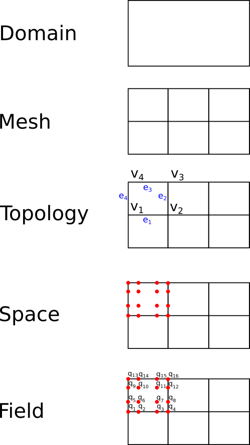

# Introduction to ClimaCore.jl's API concepts

## What is ClimaCore.jl?

A suite of tools for constructing spatial discretizations, entirely written in [Julia](https://julialang.org/).

- primarily aimed at climate and weather models
- initial aim:
  - spectral element discretizations (both Continuous Galerkin and Discontinuous Galerkin) in the horizontal
  - staggered finite difference in the vertical
  - support for Cartesian and spherical domains
- currently under development.

A sketch of some fundamental API objects in ClimaCore.jl:

