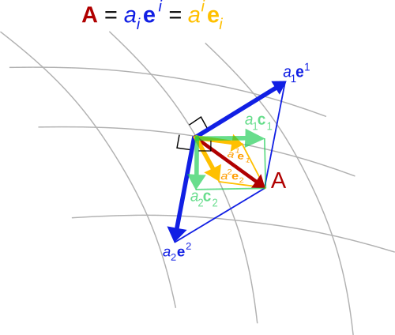

# Mathematical Framework

In this section we are going to introduce some mathematical concepts and their representations in ClimaCore.jl.


## Vectors and Vector Fields
_Vector_ can mean a few things depending on context:

- In Julia, a `Vector` is just an ordered collection of values (i.e., a container).
- In mathematics, a vector is an element of a _vector space_: a set of objects,
  which may be added together and multiplied by a scalar.
- In physics, a vector typically refers to a directional quantity: that
  something with both a _direction_ and a _magnitude_. This is the best way to
  think of vectors in ClimaCore.jl.

A _vector field_ is then a vector-valued field: that is an assignment of a
vector to each point in a space. For instance, a vector field in the plane can
be visualised as a collection of arrows with a given magnitude and direction,
each attached to a point in the plane.

In a coordinate system, a vector field on a domain in n-dimensional Euclidean
space can be represented as a vector-valued function that associates an n-tuple
of real numbers to each point of the domain. This representation of a vector
field _depends on the coordinate system_, and there are transformation laws
for passing from one coordinate system to the other.

ClmaCore supports different coordinate systems and, therefore, vector representations.
In fact, one of the key requirements of ClimaCore is to support vectors specified
in orthogonal (Cartesian) and curvilinear coordinate systems.

### `LocalVector`: `UVector`, `UVVector`, and `UVWVector`, etc; a "universal" basis

The easiest basis to use is the "UVW" basis, which can be defined in both Cartesian
or spherical domains:

- in a Cartesian domain, it is the usual Cartesian orthogonal vector basis
  (U along the X-axis, V along the Y-axis, W along the Z-axis).

- in a spherical domain, it is the orthogonal basis relative to spherical
  (curvilinear) coordinates:
  - U is the zonal (eastward) component
  - V is the meridonal (northward) component
  - W is the radial component

It has some nice properties which make it convenient:
 - it's an orthonormal basis:
   - it is easy to decompose a vector (take the projection along the basis)
   - the components are easy to interpret (they have unit scale)
 - allow us to write code across domains
   - U and V are always horizontal, W is vertical

We can define "generic" vectors via `UVector`, `UVVector`, and `UVWVector`
that can be equally defined on Cartesian or spherical spaces.

But if users need to compute with them, or feed differential operators with them,
then may want to consider different bases, as not all operators accept all bases.

### Covariant and Contravariant bases



_Covariance_ and _contravariance_ describe how the quantitative description of
certain geometric or physical entities changes with a change of basis.

In ClimaCore.jl, the _covariant basis_ is specified by the partial derivative
of the transformation from the reference element ``\xi \in [-1,1]^d`` (where ``d``
is the dimensionality of the domain ``\Omega``) to ``x`` in the physical space:
```math
\mathbf{e}_i = \frac{\partial x}{\partial \xi^i}
```
while the _contravariant basis_ is the opposite: gradient in ``x`` of the coordinate
(the inverse map)
```math
\mathbf{e}^i = \nabla_x \xi^i
```


**Note**:

* these are specific to a given element: you generally can't compare covariant or contravariant component from one element with that in another
  - in this case, you need to first convert them to UVW basis (e.g. we do this for DSS operations)

* we choose the coordinates of the reference element so that ``\xi^1`` and ``\xi^2`` are horizontal, and ``\xi^3`` is vertical
  - in a Cartesian domain, this means that covariant and contravariant components are just rescaled versions of the UVW components.\

* things get a little more complicated in the presence of terrain, but ``\xi^3`` is radially aligned
  - the 3rd covariant component is aligned with W, but the 3rd contravariant component may not be (e.g. at the surface it is normal to the boundary).

### Cartesian bases
Analogously to `CartesianPoint`s, in ClimaCore, there are also `CartesianVector`s:
these allow conversion to a global Cartesian basis. It is intended mainly for
visualization purposes.

### Conversions

To convert between different vector bases, you need a `LocalGeometry` object:
this contains all the necessary information (coordinates, metric terms, etc)
to do the conversion. These are constructed as part of the `Space`.

## Introduction to the Finite/Spectral Element Method

In finite element formulations, the weak form of a Partial Differential Equation
(PDE)---which involves integrating all terms in the PDE over the domain---is
evaluated on a subdomain ``\Omega_e`` (element) and the local results are composed
into a larger system of equations that models the entire problem on the global domain ``\Omega``.

A spectral element space is a function space in which each function is approximated
with a finite-dimensional polynomial interpolation in each element. Hence, we use
polynomials as basis functions to approximate a given function (e.g., solution state).
There are different ways of defininig basis functions: _nodal_ basis functions
and _modal_ basis functions. We use _nodal_ basis functions (e.g. by using
Lagrange interpolation), which are defined via the values of the polynomials
at particular nodal points in each element (termed Finite Element *nodes*).
Even though the basis functions can interpolate globally, it’s better to limit
each function to interpolate locally within each element, so to avoid a dense
matrix system of equations when adding up the element contributions on the
global domain ``\Omega``.

The Finite Element nodes can be chosen to coincide with those of a particular
*quadrature rule*, (this is referred to as using _collocated_ nodes) which
allows us to integrate functions over the domain.

Let us give a concrete example of strong and weak form of a PDE.
A Poisson's problem (in strong form) is given by

```math
   \nabla \cdot \nabla u = f, \textrm{ for  } \mathbf{x} \in \Omega .
```

To obtain the weak form, let us multiply all terms by a test function ``v``
and integrate by parts (i.e., apply the divergence theorem in multiple dimensions):

```math
   \int_\Omega \nabla v \cdot \nabla u \, dV - \int_{\partial \Omega} v \nabla u \cdot \hat{\mathbf n}\, dS = \int_\Omega  v f \, dV .
```

Often, we choose to represent a field (say, the velocity field) such
that ``\nabla u \cdot \hat{\mathbf n} = 0``, so that we're only left with the volumetric parts of the equation above.

The only supported choice for now in ClimaCore.jl is a `Gauss-Legendre-Lobatto`
rule and nodes.
