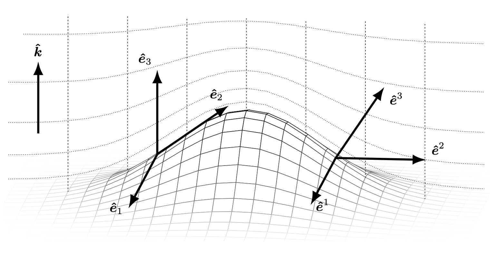

# Mathematical Framework

In this section we are going to introduce some mathematical concepts and their representations in ClimaCore.jl.


## Vectors and Vector Fields
_Vector_ can mean a few things depending on context:

- In Julia, a `Vector` is just an ordered collection of values (i.e., a container).
- In mathematics, a vector is an element of a _vector space_: a set of objects,
  which may be added together and multiplied by a scalar.
- In physics, a vector typically refers to a directional quantity: that
  something with both a _direction_ and a _magnitude_. This is the best way to
  think of vectors in ClimaCore.jl.

A _vector field_ is then a vector-valued field: that is an assignment of a
vector to each point in a space. For instance, a vector field in the plane can
be visualised as a collection of arrows with a given magnitude and direction,
each attached to a point in the plane.

In a coordinate system, a vector field on a domain in n-dimensional Euclidean
space can be represented as a vector-valued function that associates an n-tuple
of real numbers to each point of the domain. This representation of a vector
field _depends on the coordinate system_, and there are transformation laws
for passing from one coordinate system to the other.

ClimaCore supports different coordinate systems and, therefore, vector representations.
In fact, one of the key requirements of ClimaCore is to support vectors specified
in orthogonal (Cartesian) and curvilinear coordinate systems.

### `LocalVector`: `UVector`, `UVVector`, and `UVWVector`, etc; a "universal" basis

The easiest basis to use is the "UVW" basis, which can be defined in both Cartesian
or spherical domains:

- in a Cartesian domain, it is the usual Cartesian orthogonal vector basis
  (U along the X-axis, V along the Y-axis, W along the Z-axis).

- in a spherical domain, it is the orthogonal basis relative to spherical
  (curvilinear) coordinates:
  - U is the zonal (eastward) component
  - V is the meridonal (northward) component
  - W is the radial component

It has some nice properties which make it convenient:
 - it's an orthonormal basis:
   - it is easy to decompose a vector (take the projection along the basis)
   - the components are easy to interpret (they have unit scale)
 - allow us to write code across domains
   - U and V are always horizontal, W is vertical

We can define "generic" vectors via `UVector`, `UVVector`, and `UVWVector`
that can be equally defined on Cartesian or spherical spaces.

But if users need to compute with them, or feed differential operators with them,
then may want to consider different bases, as not all operators accept all bases.

### Covariant and Contravariant bases


_Covariance_ and _contravariance_ describe how the quantitative description of
certain geometric or physical entities changes with a change of basis.

More specifically, 

__Covariant objects__ —whether you mean covariant components (the coefficients that sit in front of the basis) 
or the covariant basis vectors themselves—co-vary with the coordinate grid. In other words, when you change coordinates, 
these quantities transform in the same way as the coordinate differentials. By convention they carry lower indices (subscripts).

__Contravariant objects__—whether you mean contravariant components or the contravariant basis vectors—vary contra 
to the coordinate grid. That is, they transform in the opposite way to the coordinate differentials so as to keep 
tensorial expressions invariant. By convention they carry upper indices (superscripts).

In ClimaCore.jl, `CovariantVector`s are aligned with the _contravariant basis vectors_, but have _covariant components_. 
Conversely, `ContravariantVector`s are aligned with the _covariant basis vectors_, but have _contravariant components_. 

In ClimaCore.jl, the _covariant basis_ is specified by the partial derivative
of the transformation from the reference element ``\xi \in [-1,1]^d`` (where ``d``
is the dimensionality of the domain ``\Omega``) to ``x`` in the physical space:
```math
\mathbf{e}_i = \frac{\partial x}{\partial \xi^i}
```
while the _contravariant basis_ is the opposite: gradient in ``x`` of the coordinate
(the inverse map)
```math
\mathbf{e}^i = \nabla_x \xi^i
```

If we plot these bases in a curvilinear space, _covariant basis_ vectors “ride along” the coordinate surface liness (parallel),  while _contravariant basis_ vectors “stick out” of those surface lines (perpendicular). See the plot below:



Here is a visual representation of how vectors can be represented in _contravariant_ and _covariant_ components (reference [Yatunin2025](@cite).).


Start with the _contravariant components_, which is exactly the definition of vectors we usually meet. 
As it can be seen in the figure above, we have a 2D vector $\vec{a}$, 
and two unit vectors $\vec{e_{1}}$ and $\vec{e_{2}}$, served as two basis. Thus we can represent vector $\vec{a}$ as:
```math
\vec{a} = a^{1} \vec{e_{1}} + a^{2} \vec{e_{2}}
```

And now we set amplify one of the basis $\vec{a}$ by 2 times, that is $\vec{e_{1}}^{'} = 2\vec{e_{1}}$. 
If we want to maintain the vector $\vec{a}$ to stay still, 
obviously we need to set $a^{1}$ to its half:
```math
a^{1'}  = \frac{1}{2} a^{1}
```

With this being said, the components we use to describe a certain vector are changing in the opposite manner of the the basis, 
and we are calling these components _contravariant components_. This case corresponds to the definition of `ContravariantVector`s in ClimaCore.jl. 

Now consider the _covariant components_. We still have a 2D vector, but calling it $\vec{b}$. 
So if with the unit vectors $\vec{e_{1}}$ and $\vec{e_{2}}$, we can still 
represent vector $\vec{b}$ in a "controvariant component" manner:
```math
\vec{b} = b^{1} \vec{e_{1}} + b^{2} \vec{e_{2}}
```

Then we try to project vector $\vec{b}$ onto the two unit vectors, and we have the following:
```math
b_{1} = \vec{b}\cdot  \vec{e_{1}}
```
```math
b_{2} = \vec{b}\cdot  \vec{e_{2}}
```

If we plug $\vec{b} = b^{1} \vec{e_{1}} + b^{2} \vec{e_{2}}$ into the above two equations, we can have:
```math
b_{1} = \vec{b}\cdot  \vec{e_{1}} = b^{1} \vec{e_{1}} \cdot \vec{e_{1}}+ b^{2} \vec{e_{2}}\cdot \vec{e_{1}} 
```
```math
b_{2} = \vec{b}\cdot  \vec{e_{2}} = b^{2} \vec{e_{2}} \cdot \vec{e_{1}}+ b^{2} \vec{e_{2}}\cdot \vec{e_{2}} 
```

And in this case, if we still amplify one of the basis $\vec{a}$ by 2 times, 
it is not difficult to find that $b_{1}$ would also be amplified by 2 times!
```math
b_{1}^{'} = b^{1} \vec{e_{1}}^{'} \cdot \vec{e_{1}}+ b^{2} \vec{e_{2}}\cdot \vec{e_{1}}^{'} = 2 (b^{1} \vec{e_{1}} \cdot \vec{e_{1}}+ b^{2} \vec{e_{2}}\cdot \vec{e_{1}} )
```

In this case, the components of this vector are changing in the same manner of the the basis, and we are calling these 
components _covariant components_. This case corresponds to the definition of `CovariantVector`s in ClimaCore.jl. 

From these two illustrative examples, we can see that parallel projections would lead to controvariant components, 
while perpendicular projection would lead to covariant components.

As to better connect the original idea of _covariant components_ / _contravariant components_ with the real application in ClimaCore.jl, 
we bring the case of __polar coordinates__ -- a classic example of a __curvilinear coordinate system__.

First of all, we have the Polar‐to‐Cartesian mapping as following:
```math
\vec{r} (r,\theta ) = (r \cos \theta, r \sin \theta)
```

Then we have the _covariant basis_:
```math
\vec{e_{r} } = \frac{\partial \vec{r} }{\partial r}  = \frac{\partial (r \cos \theta, r \sin \theta) }{\partial r} = (\cos \theta, \sin \theta)
```
```math
\vec{e_{\theta} } = \frac{\partial \vec{r} }{\partial \theta }  = \frac{\partial (r \cos \theta, r \sin \theta) }{\partial \theta } = (-r\sin \theta,r \cos \theta)
```

$\vec{e_{r} }$ represents the direction that is tangent to the "radius direction", and $\vec{e_{\theta} }$ is tangent to the circle curve itself.

And the _contravariant basis_:

since we have $r(x,y) = \sqrt{x^{2} +y^{2}  }$ and $\theta (x,y) = \arctan (\frac{y}{x} )$. Thus,

```math
\vec{e^{r} } = \nabla r(x,y) = (\frac{x}{\sqrt{x^{2} +y^{2}  }}, \frac{y}{\sqrt{x^{2} +y^{2}  }}) = (\frac{x}{r},\frac{y}{r} ) = (\cos \theta, \sin \theta)
```
```math
\vec{e^{\theta } } = \nabla \theta(x,y) = (\frac{-y}{x^{2} +y^{2}}, \frac{x}{x^{2} +y^{2}})  = (\frac{-\sin \theta}{r} , \frac{\cos \theta}{r})
```

$\vec{e^{r} }$ represents the direction that is perpendicular to the circle curve, and $\vec{e^{\theta} }$ is perpendicular to the "radius direction".


**Note**:

* these are specific to a given element: you generally can't compare covariant or contravariant component from one element with that in another
  - in this case, you need to first convert them to UVW basis (e.g. we do this for DSS operations)

* we choose the coordinates of the reference element so that ``\xi^1`` and ``\xi^2`` are horizontal, and ``\xi^3`` is vertical
  - in a Cartesian domain, this means that covariant and contravariant components are just rescaled versions of the UVW components.\

* things get a little more complicated in the presence of terrain, but ``\xi^3`` is radially aligned
  - the 3rd covariant component is aligned with W, but the 3rd contravariant component may not be (e.g. at the surface it is normal to the boundary).
 


### Cartesian bases
Analogously to `CartesianPoint`s, in ClimaCore, there are also `CartesianVector`s:
these allow conversion to a global Cartesian basis. It is intended mainly for
visualization purposes.

### Conversions

To convert between different vector bases, you need a `LocalGeometry` object:
this contains all the necessary information (coordinates, metric terms, etc)
to do the conversion. These are constructed as part of the `Space`.

## Introduction to the Finite/Spectral Element Method

In finite element formulations, the weak form of a Partial Differential Equation
(PDE)---which involves integrating all terms in the PDE over the domain---is
evaluated on a subdomain ``\Omega_e`` (element) and the local results are composed
into a larger system of equations that models the entire problem on the global domain ``\Omega``.

A spectral element space is a function space in which each function is approximated
with a finite-dimensional polynomial interpolation in each element. Hence, we use
polynomials as basis functions to approximate a given function (e.g., solution state).
There are different ways of defininig basis functions: _nodal_ basis functions
and _modal_ basis functions. We use _nodal_ basis functions (e.g. by using
Lagrange interpolation), which are defined via the values of the polynomials
at particular nodal points in each element (termed Finite Element *nodes*).
Even though the basis functions can interpolate globally, it’s better to limit
each function to interpolate locally within each element, so to avoid a dense
matrix system of equations when adding up the element contributions on the
global domain ``\Omega``.

The Finite Element nodes can be chosen to coincide with those of a particular
*quadrature rule*, (this is referred to as using _collocated_ nodes) which
allows us to integrate functions over the domain.

Let us give a concrete example of strong and weak form of a PDE.
A Poisson's problem (in strong form) is given by

```math
   \nabla \cdot \nabla u = f, \textrm{ for  } \mathbf{x} \in \Omega .
```

To obtain the weak form, let us multiply all terms by a test function ``v``
and integrate by parts (i.e., apply the divergence theorem in multiple dimensions):

```math
   \int_\Omega \nabla v \cdot \nabla u \, dV - \int_{\partial \Omega} v \nabla u \cdot \hat{\mathbf n}\, dS = \int_\Omega  v f \, dV .
```

Often, we choose to represent a field (say, the velocity field) such
that ``\nabla u \cdot \hat{\mathbf n} = 0``, so that we're only left with the volumetric parts of the equation above.

The only supported choice for now in ClimaCore.jl is a `Gauss-Legendre-Lobatto`
rule and nodes.
