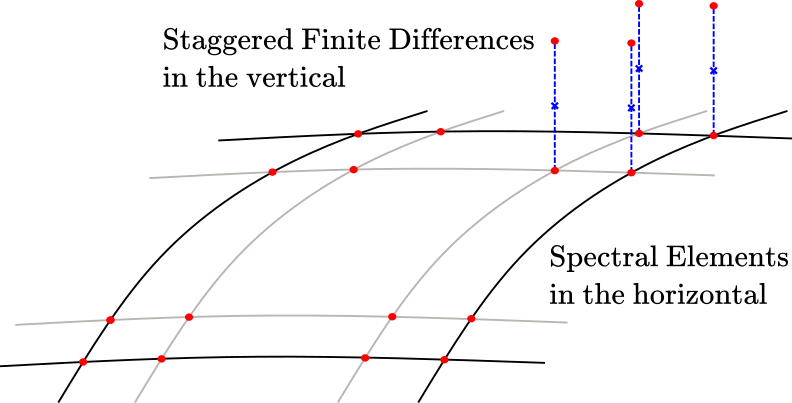

# Spaces

```@meta
CurrentModule = ClimaCore
```

A space is a grid together with the information a field needs to live on it:
for a vertical grid, the staggering (cell centers or cell faces). Two
discretizations are provided, spectral elements (continuous or discontinuous
Galerkin) in the horizontal and staggered finite differences in the vertical,
and their product is an *extruded* (hybrid) space.



*An extruded space on a box: spectral elements with their quadrature nodes in
the horizontal, stacked over the cells of a staggered vertical grid.*

```@docs
Spaces
Spaces.Δz_data
```

## Finite Difference Spaces

A finite-difference space holds one value per cell of an interval mesh,
either at the cell centers (`CenterFiniteDifferenceSpace`) or at the faces
between cells (`FaceFiniteDifferenceSpace`). Construct one of the two from the
mesh and derive the other from it with `Spaces.face_space` or
`Spaces.center_space`; the two share one grid and no geometry is allocated
twice.

```@docs
Spaces.FiniteDifferenceSpace
```

## Spectral Element Spaces

```@docs
Spaces.SpectralElementSpace1D
Spaces.SpectralElementSpace2D
Spaces.SpectralElementSpaceSlab
```

### Discretization: CG or DG

The Galerkin discretization of a spectral-element grid is a type parameter of
the grid, set with the `discretization` keyword of the grid and space
constructors and read back from the space
([Choose CG or DG](../howto/choose_cg_dg.md)).

The types and accessors are documented on the [Grids](grids.md) page:
`Grids.Discretization`, `Grids.CG`, `Grids.DG`, `Grids.discretization`,
`Grids.is_continuous`. `Spaces.discretization` and `Spaces.is_continuous` are
the same functions applied to a space.

```@docs
Spaces.node_horizontal_length_scale
```

## Extruded Finite Difference Spaces

```@docs
Spaces.ExtrudedFiniteDifferenceSpace
```

## Point Spaces

```@docs
Spaces.PointSpace
```

## Multi-column Spaces

```@docs
Spaces.MultiPointSpace
Spaces.MultiColumnFiniteDifferenceSpace
```

## Utilities

```@docs
Spaces.area
Spaces.local_area
```
