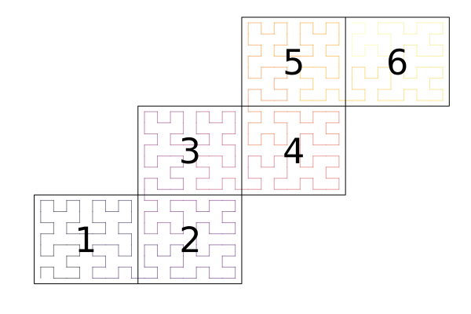

# Topologies

```@meta
CurrentModule = ClimaCore
```

A topology determines the ordering and connections between elements of a mesh.


## Types

```@docs
Topologies.AbstractTopology
Topologies.IntervalTopology
Topologies.Topology2D
Topologies.spacefillingcurve
```

## Interfaces

```@docs
Topologies.mesh
Topologies.nelems
Topologies.nlocalelems
Topologies.nneighbors
Topologies.neighbors
Topologies.vertex_coordinates
Topologies.local_vertices
Topologies.opposing_face
Topologies.interior_faces
Topologies.boundary_tags
Topologies.boundary_tag
Topologies.boundary_faces
Topologies.local_neighboring_elements
```
