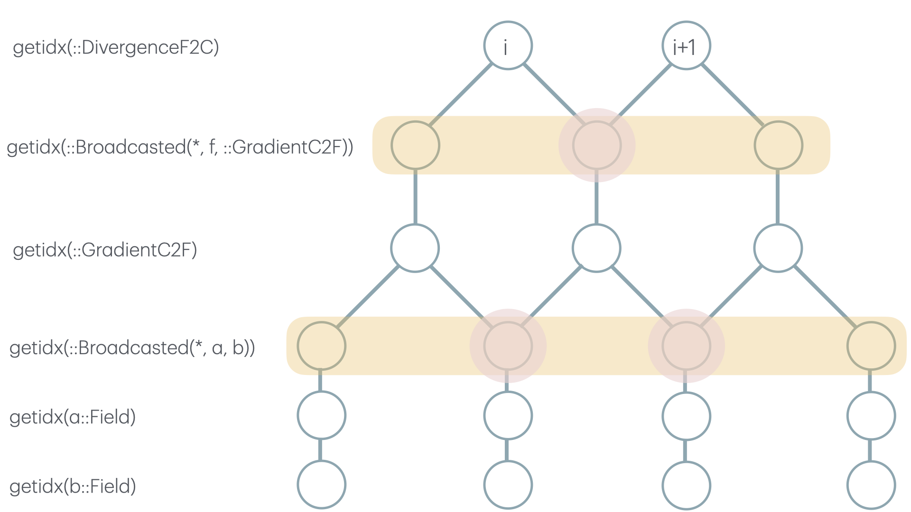

# Shared memory design

ClimaCore stencil operators support staggered (or collocated) finite difference
and interpolation operations. For example, the `DivergenceF2C` operator takes
an argument that lives on the cell faces and the resulting divergence
calculation lives on the cell centers. Such operations are effectively
matrix-vector multiplication and are often a significant portion of the runtime
cost for users.

Here, we outline an optimization, shared memory (or, "shmem" for short), that we
use to improve the performance of these operations.

## Motivation

A naive and simplified implementation of this operation looks like `div[i] = (f
[i+1] - f[i]) / dz[i]`. Such a calculation on the gpu (or cpu) requires `f[i]`
be read from global memory to compute the result of `div[i]` and `div[i-1]`. Not
to mention, if `f` is a `Broadcasted` object (`Broadcasted` objects behave like
arrays, and support `f[i]` behavior), then `f[i]` may require several reads and
or computations.

Reading data from global memory is often the main bottleneck for
bandwidth-limited cuda kernels. As such, we use shmem to reduce the number of global memory reads (and compute) in our kernels.

## High-level design

The high-level view of the design is:

 - The `bc::StencilBroadcasted` type has a `work` field, which is used to store
   shmem for the `bc.op` operator. The element type of the `work`
   (or parts of `work` if there are multiple parts) is the type returned by the
   `bc.op`'s `Operator.return_eltype`.
 - Recursively reconstruct the broadcasted object, allocating shmem for
   each `StencilBroadcasted` along the way that supports shmem
   (different operators require different arguments, and therefore different
   types and amounts of shmem).
 - Recursively fill the shmem for all `StencilBroadcasted`. This is done
   by reading the argument data from `getidx`. See the section discussion below for more details.
 - The destination field is filled with the result of `getidx` (as it is without
   shmem), except that we overload `getidx` (for supported `StencilBroadcasted`
   types) to retrieve the result of `getidx` via `fd_operator_evaluate`, which
   retrieves the result from the shmem, instead of global memory.

### Populating shared memory, and memory access safety

We use tail-recursion when filling shared memory of the broadcast expressions.
That is, we visit leaves of the broadcast expression, then work our way up.
It's important to note that the `StencilBroadcasted` and `Broadcasted` can be
interleaved.

Let's take `DivergenceF2C()(f*GradientC2F()(a*b)))` as an example (depicted in
the image below).

Recursion must go through the entire expression in order to ensure that we've
reached all of the leaves of the `StencilBroadcasted` objects (otherwise, we
could introduce race conditions with memory access). The leaves of the
`StencilBroadcasted` will call `getidx`, below which there are (by definition)
no more `StencilBroadcasted`, and those `getidx` calls will read from global
memory. All subsequent reads will be from shmem(as they will be caught by the
`getidx(parent_space, bc::StencilBroadcasted
{CUDAWithShmemColumnStencilStyle}, idx, hidx)` defined in the
`ClimaCoreCUDAExt` module).

In the diagram below, we traverse and fill the yellow highlighted sections
(bottom first and top last). The algorithmic impact of using shared memory is
that the duplicate global memory reads (highlighted in red circles) become one
global memory read (performed in `fd_operator_fill_shmem!`).

Finally, its important to note that threads must by syncrhonized after each node
in the tree is filled, to avoid race conditions for subsequent `getidx
(parent_space, bc::StencilBroadcasted{CUDAWithShmemColumnStencilStyle}, idx,
hidx)` calls (which are retrieved via shmem).

